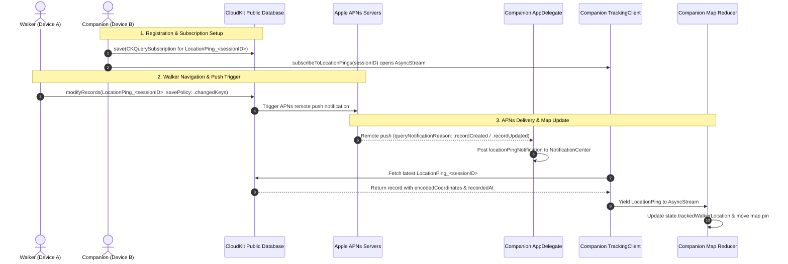

# Apple Push Notification (APNs) & CloudKit Architecture Guide

This document provides a comprehensive breakdown of the Apple Push Notification (APNs) and CloudKit subscription architecture in **Astar**, explaining the root causes of why the initial implementation failed and how the revised pipeline operates end-to-end.

---

## 1. Why the Initial Code Did Not Work

Before the fix, the app failed to receive live location updates via push notifications and accumulated hundreds of duplicate records in CloudKit due to **5 cascading bugs**:

### Bug 1: `LocationPing` Database Row Explosion
* **Initial Code** ([`TrackingClient.swift`](file:///Users/nad/Developer/XCode/Astar/Astar/Shared/CloudKit/TrackingClient.swift)):
  ```swift
  // ❌ FLAW: Instantiating CKRecord without an explicit recordID
  let pingRecord = CKRecord(recordType: "LocationPing")
  pingRecord["sessionRef"] = sessionRef
  pingRecord["encodedCoordinates"] = [coordinatesData]
  pingRecord["recordedAt"] = Date()
  try await db.save(pingRecord)
  ```
* **Why it failed**: Every time `didUpdateLocation` fired (every 1–3 seconds while walking), CloudKit generated a brand-new UUID for each ping. A 15-minute walk generated hundreds of orphan database rows instead of maintaining the walker's latest state.

---

### Bug 2: Fatal Record ID Comparison Mismatch
* **Initial Code** ([`TrackingClient.swift`](file:///Users/nad/Developer/XCode/Astar/Astar/Shared/CloudKit/TrackingClient.swift)):
  ```swift
  // ❌ FLAW: Comparing LocationPing recordID against WalkSession sessionID
  guard recordID.recordName == sessionID else {
      print("[TrackingClient] Ignored notification for non-matching sessionID: \(recordID.recordName)")
      continue
  }
  ```
* **Why it failed**: When CloudKit dispatches an APNs notification for a `LocationPing` record, `recordID` is the ID of that `LocationPing` record (e.g. `245802E0-1C71...`). `sessionID` is the ID of the parent `WalkSession` record (e.g. `WalkSession_abc`).
  Comparing `recordID.recordName == sessionID` evaluated to `false` **100% of the time**. Every single incoming push notification was discarded.

---

### Bug 3: `AppDelegate` Dropped All `.recordUpdated` Notifications
* **Initial Code** ([`AppDelegate.swift`](file:///Users/nad/Developer/XCode/Astar/Astar/App/AppDelegate/AppDelegate.swift)):
  ```swift
  // ❌ FLAW: Only accepting .recordCreated
  if let queryNotification = notification as? CKQueryNotification,
     queryNotification.queryNotificationReason == .recordCreated {
      ...
  } else {
      completionHandler(.noData)
  }
  ```
* **Why it failed**: When modifying a single record, only the very first location ping has reason `.recordCreated`. All subsequent location updates while walking have reason `.recordUpdated`. `AppDelegate` ignored all `.recordUpdated` events and returned `.noData`.

---

### Bug 4: Missing Background Modes in `Astar-Info.plist`
* **Initial Configuration**: `Astar-Info.plist` did not contain the `UIBackgroundModes` key.
* **Why it failed**: CloudKit query subscriptions send silent background push notifications (`content-available = 1`) to wake the companion app. Without `<string>remote-notification</string>` under `UIBackgroundModes`, iOS suspended notification delivery whenever the app was in the background.

---

### Bug 5: Push Subscription Leaks on Session Exit
* **Initial Code**: When a companion exited the tracking view or when a walker reached their destination, `deleteSubscription(withID:)` was not invoked, leaving dangling subscriptions on Apple's servers.

---

## 2. The New APNs Architecture

The updated codebase implements a deterministic, single-record upsert model with an end-to-end APNs push pipeline.

### End-to-End Sequence Diagram



---

## 3. Detailed Component Implementation in New Code

### 1. Single Deterministic Record Upsert ([`TrackingClient.swift`](file:///Users/nad/Developer/XCode/Astar/Astar/Shared/CloudKit/TrackingClient.swift#L141-L186))
Instead of creating a new row on every step, `pushLocationPing` uses a fixed record ID `LocationPing_<sessionID>` and saves with `savePolicy: .changedKeys`:

```swift
pushLocationPing: { sessionID, coordinatesData in
    let db = CKContainer.default().publicCloudDatabase
    let pingRecordID = CKRecord.ID(recordName: "LocationPing_\(sessionID)")
    let pingRecord = CKRecord(recordType: "LocationPing", recordID: pingRecordID)
    let sessionRef = CKRecord.Reference(recordID: CKRecord.ID(recordName: sessionID), action: .none)
    let pingTime = Date()

    pingRecord["sessionRef"] = sessionRef
    pingRecord["encodedCoordinates"] = [coordinatesData]
    pingRecord["recordedAt"] = pingTime

    // Upsert single deterministic record
    let (saveResults, _) = try await db.modifyRecords(
        saving: [pingRecord],
        deleting: [],
        savePolicy: .changedKeys,
        atomically: false
    )
    ...
}
```

---

### 2. CloudKit Query Subscription ([`TrackingClient.swift`](file:///Users/nad/Developer/XCode/Astar/Astar/Shared/CloudKit/TrackingClient.swift#L193-L250))
When tracking begins, a `CKQuerySubscription` is registered with Apple's push servers targeting `LocationPing_<sessionID>`:

```swift
let pingRecordID = CKRecord.ID(recordName: "LocationPing_\(sessionID)")
let predicate = NSPredicate(format: "recordID == %@", pingRecordID)

let subscription = CKQuerySubscription(
    recordType: "LocationPing",
    predicate: predicate,
    subscriptionID: "walk-session-\(sessionID)",
    options: [.firesOnRecordCreation, .firesOnRecordUpdate, .firesOnRecordDeletion]
)

let info = CKSubscription.NotificationInfo()
info.shouldSendContentAvailable = true // Silent background wake
info.alertBody = "A location was updated in the public database."
info.soundName = "default"
info.desiredKeys = ["encodedCoordinates", "sessionRef", "recordedAt"]

subscription.notificationInfo = info
try await db.save(subscription)
```

---

### 3. Remote Notification Handling ([`AppDelegate.swift`](file:///Users/nad/Developer/XCode/Astar/Astar/App/AppDelegate/AppDelegate.swift#L32-L55))
Handles both `.recordCreated` and `.recordUpdated`, attaching timestamp metadata:

```swift
func application(_ application: UIApplication, didReceiveRemoteNotification userInfo: [AnyHashable : Any], fetchCompletionHandler completionHandler: @escaping (UIBackgroundFetchResult) -> Void) {
    let receiveTime = Date()
    guard let notification = CKNotification(fromRemoteNotificationDictionary: userInfo) else {
        completionHandler(.noData)
        return
    }

    if let queryNotification = notification as? CKQueryNotification,
       (queryNotification.queryNotificationReason == .recordCreated || queryNotification.queryNotificationReason == .recordUpdated) {
        if let recordID = queryNotification.recordID {
            NotificationCenter.default.post(
                name: AppDelegate.locationPingNotification,
                object: nil,
                userInfo: ["recordID": recordID, "receivedAt": receiveTime]
            )
        }
        completionHandler(.newData)
    } else {
        completionHandler(.noData)
    }
}
```

---

### 4. Matching & Stream Delivery ([`TrackingClient.swift`](file:///Users/nad/Developer/XCode/Astar/Astar/Shared/CloudKit/TrackingClient.swift#L252-L313))
Matches incoming record IDs against `LocationPing_<sessionID>` and yields decoded coordinates:

```swift
subscribeToLocationPings: { sessionID in
    AsyncStream { continuation in
        let db = CKContainer.default().publicCloudDatabase
        let expectedPingRecordName = "LocationPing_\(sessionID)"

        let task = Task {
            for await notification in NotificationCenter.default.publisher(for: AppDelegate.locationPingNotification).values {
                guard let userInfo = notification.userInfo,
                      let recordID = userInfo["recordID"] as? CKRecord.ID else { continue }

                guard recordID.recordName == expectedPingRecordName || recordID.recordName == sessionID else {
                    continue
                }

                let record = try await db.record(for: recordID)
                if let encodedCoordinates = record["encodedCoordinates"] as? [Data] {
                    let ping = LocationPing(
                        id: record.recordID.recordName,
                        sessionRef: sessionID,
                        encodedCoordinates: encodedCoordinates,
                        recordedAt: record["recordedAt"] as? Date ?? Date()
                    )
                    continuation.yield(ping)
                }
            }
        }
        continuation.onTermination = { _ in task.cancel() }
    }
}
```

---

## 4. Key iOS & CloudKit Configuration Checklist

| Setting | Location | Required Value | Purpose |
| :--- | :--- | :--- | :--- |
| **APS Environment** | `Astar.entitlements` | `development` / `production` | Enables Apple Push Notification capability |
| **CloudKit Containers** | `Astar.entitlements` | `iCloud.com.astar.trail.apn` | Links app to CloudKit container database |
| **Background Modes** | `Astar-Info.plist` | `remote-notification` | Allows iOS to deliver silent push notifications in background |
| **Push Registration** | `AppDelegate.swift` | `registerForRemoteNotifications()` | Registers device token with Apple APNs |

> [!IMPORTANT]
> **CloudKit Echo Suppression**: CloudKit automatically avoids sending push notifications back to the device that performed the record save. To test live APNs push updates, use **two separate physical devices or accounts** (one as the walker and one as the companion).
