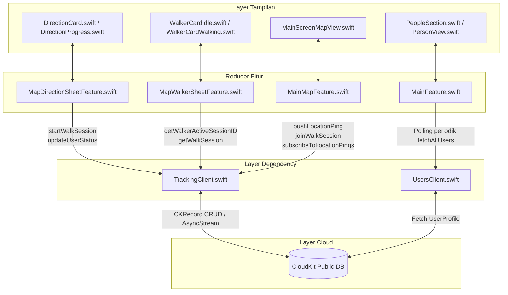

# Arsitektur Teknis: `TrackingClient.swift` & Ekosistem Antar-File

## 1. Topologi Sistem & Matriks Antar-File



### Matriks Tanggung Jawab File & Dependensi

| File | Peran | Interaksi Langsung dengan `TrackingClient` |
| :--- | :--- | :--- |
| [`TrackingClient.swift`](file:///Users/dimasps32/Developer/apple-dev/challenge-apple-dev/challenge-5/Astar/Astar/Shared/CloudKit/TrackingClient.swift) | Layer Layanan / Client | Mengenkapsulasi operasi CloudKit (`CKContainer.default().publicCloudDatabase`), model data, dan logika streaming. |
| [`MapDirectionSheetFeature.swift`](file:///Users/dimasps32/Developer/apple-dev/challenge-apple-dev/challenge-5/Astar/Astar/Features/Map/MapDirectionSheetFeature.swift) | Reducer Navigasi Pejalan Kaki | Memanggil `startWalkSession` dan `updateUserStatus("walking")` saat navigasi dimulai; memanggil `updateUserStatus("idle")` saat selesai/dibatalkan. |
| [`MapWalkerSheetFeature.swift`](file:///Users/dimasps32/Developer/apple-dev/challenge-apple-dev/challenge-5/Astar/Astar/Features/Map/MapWalkerSheetFeature.swift) | Reducer Sheet Pendamping | Mengambil data via `getWalkerActiveSessionID` dan `getWalkSession` untuk memuat metadata pejalan kaki sebelum bergabung ke sesi. |
| [`MainMapFeature.swift`](file:///Users/dimasps32/Developer/apple-dev/challenge-apple-dev/challenge-5/Astar/Astar/Features/Map/MainMapFeature.swift) | Koordinator Peta Utama | **Mode Walker**: Mengirim titik GPS via `pushLocationPing`.<br>**Mode Companion**: Memanggil `joinWalkSession`, menerima data dari `subscribeToLocationPings`, dan memperbarui marker peta. |
| [`MainFeature.swift`](file:///Users/dimasps32/Developer/apple-dev/challenge-apple-dev/challenge-5/Astar/Astar/Features/Main/MainFeature.swift) | Reducer Root Aplikasi | Melakukan polling `UsersClient.fetchAllUsers` tiap 6 detik untuk sinkronisasi status presensi pengguna (`"Walking"`, `"Idle"`, `"Accompanying"`). |
| [`MainScreenMapView.swift`](file:///Users/dimasps32/Developer/apple-dev/challenge-apple-dev/challenge-5/Astar/Astar/Features/Map/View/MainScreenMapView.swift) | Tampilan Peta SwiftUI | Menampilkan pembaruan koordinat langsung, polyline rute, dan menangani event kembali ke foreground (`willEnterForegroundNotification`). |

---

## 2. Skema Database CloudKit

`TrackingClient` menggunakan tiga tipe *record* utama di Public Cloud Database:

```
[UserProfile] (Dikelola oleh LoginFeature & UsersClient)
  ├── recordID: "UserProfile_<appleUID>_<cloudUID>"
  ├── name: String
  ├── email: String
  ├── Status: String ("idle" | "walking" | "accompany")
  ├── activeWalkSessionRef: Reference -> [WalkSession]
  └── watchingSessionRef: Reference -> [WalkSession]

[WalkSession]
  ├── recordID: UUID String
  ├── walkerRef: Reference -> [UserProfile]
  ├── status: String ("active" | "completed")
  ├── destinationName: String
  ├── destinationLatitude: Double
  ├── destinationLongitude: Double
  ├── routePolyline: String (Opsional, polyline terenkripsi)
  ├── startedAt: Date
  ├── endedAt: Date (Opsional)
  └── lastPingAt: Date

[SessionParticipant]
  ├── recordID: UUID String
  ├── sessionRef: Reference -> [WalkSession]
  ├── companionRef: Reference -> [UserProfile]
  └── joinedAt: Date

[LocationPing]
  ├── recordID: UUID String
  ├── sessionRef: Reference -> [WalkSession]
  ├── encodedCoordinates: [Data] (Array byte koordinat GPS terenkode)
  └── recordedAt: Date
```

---

## 3. Spesifikasi Fungsi `TrackingClient`

### 3.1. `startWalkSession`
```swift
var startWalkSession: @Sendable (
    _ walkerRecordID: String,
    _ destinationName: String,
    _ destLat: Double,
    _ destLon: Double,
    _ routePolyline: String?
) async throws -> WalkSession
```
- **Mekanisme**: Membuat `CKRecord(recordType: "WalkSession")` baru, memasang `CKRecord.Reference` ke `walkerRecordID`, mencatat timestamp awal, dan menyimpan ke database via `db.save(record)`.
- **Pemanggil**: [`MapDirectionSheetFeature.swift:216`](file:///Users/dimasps32/Developer/apple-dev/challenge-apple-dev/challenge-5/Astar/Astar/Features/Map/MapDirectionSheetFeature.swift#L216)

### 3.2. `updateUserStatus`
```swift
var updateUserStatus: @Sendable (
    _ userRecordID: String,
    _ status: String,
    _ activeSessionID: String?,
    _ watchingSessionID: String?
) async throws -> Void
```
- **Mekanisme**: Mengambil record `UserProfile` berdasarkan ID, mengubah nilai `Status`, menetapkan atau menghapus referensi `activeWalkSessionRef` dan `watchingSessionRef`, lalu menyimpan perubahan.
- **Pemanggil**:
  - `MapDirectionSheetFeature`: Menyetel status ke `"walking"` saat mulai, `"idle"` saat selesai.
  - `MainMapFeature`: Menyetel status ke `"accompany"` saat mendampingi, `"idle"` saat berhenti.

### 3.3. `pushLocationPing`
```swift
var pushLocationPing: @Sendable (
    _ sessionID: String,
    _ coordinatesData: Data
) async throws -> Void
```
- **Mekanisme**:
  1. Membuat `CKRecord(recordType: "LocationPing")` dengan referensi `sessionRef` menuju `sessionID`.
  2. Menyimpan payload data koordinat ke field `encodedCoordinates`.
  3. Menyimpan record ke CloudKit.
  4. Sekaligus memperbarui `lastPingAt` pada record `WalkSession` induk.
- **Pemanggil**: [`MainMapFeature.swift:175`](file:///Users/dimasps32/Developer/apple-dev/challenge-apple-dev/challenge-5/Astar/Astar/Features/Map/MainMapFeature.swift#L175) di dalam stream delegate CoreLocation.

### 3.4. `subscribeToLocationPings`
```swift
var subscribeToLocationPings: @Sendable (
    _ sessionID: String
) async throws -> AsyncStream<LocationPing>
```
- **Mekanisme**:
  1. Mengembalikan `AsyncStream<LocationPing>`.
  2. Menjalankan `Task` loop polling internal selama `!Task.isCancelled`.
  3. Mengambil data via `CKQuery(recordType: "LocationPing", predicate: NSPredicate(value: true))`.
  4. Memfilter record secara lokal di memori berdasarkan kecocokan `sessionRef == sessionID` atau `walkerRef`.
  5. Meneruskan ping terbaru via `continuation.yield(ping)`.
  6. Menunggu selama 3 detik sebelum polling berikutnya.
  7. Mengaitkan `continuation.onTermination` ke `task.cancel()`, mencegah kebocoran proses latar belakang saat pengguna menutup tampilan.
- **Pemanggil**: [`MainMapFeature.swift:701`](file:///Users/dimasps32/Developer/apple-dev/challenge-apple-dev/challenge-5/Astar/Astar/Features/Map/MainMapFeature.swift#L701).

---

## 4. Alur Penelusuran Eksekusi (Execution Traces)

### Skenario 1: Walker Memulai Sesi & Mengirim Titik GPS

```
1. Pengguna menekan tombol "Start Navigation" di DirectionCard.swift
   └─► Memicu MapDirectionSheetFeature.Action.startNavigationTapped
       ├─► Mutasi State: state.isNavigating = true, state.mode = .progress
       └─► Menjalankan .run Effect:
           ├─► TrackingClient.startWalkSession(userRecordID, destName, lat, lon, polyline)
           │   └─► Menyimpan CKRecord(type: "WalkSession") -> mengembalikan WalkSession(id: "WS_123")
           ├─► TrackingClient.updateUserStatus(userRecordID, "walking", "WS_123", nil)
           │   └─► Memperbarui UserProfile di CloudKit
           └─► Mengirim aksi delegate Action.navigationStarted(sessionID: "WS_123")

2. MainMapFeature menerima Action.directionSheet(.delegate(.navigationStarted("WS_123")))
   └─► Mutasi State: state.activeUserWalkSessionID = "WS_123"

3. CoreLocation memancarkan pembaruan posisi pada stream LocationManagerClient
   └─► MainMapFeature menerima Action.locationManager(.didUpdateLocations(locations))
       └─► Memeriksa guard state.activeUserWalkSessionID != nil
           ├─► Mengenkode CLLocationCoordinate2D menjadi payload Data
           └─► Memanggil TrackingClient.pushLocationPing("WS_123", data)
               ├─► Menulis CKRecord(type: "LocationPing")
               └─► Memperbarui WalkSession.lastPingAt
```

---

### Skenario 2: Companion Menemukan, Bergabung, dan Menerima Lokasi Langsung

```
1. Loop periodik MainFeature (tiap 6 detik) menjalankan Action.refreshPeople
   └─► UsersClient.fetchAllUsers() -> meminta data tabel UserProfile di CloudKit
       └─► Status Walker terdeteksi sebagai "walking"
           └─► MainFeature memperbarui state.people -> PersonView menampilkan status "Walking"

2. Companion menekan avatar Walker di PeopleSection.swift
   └─► MainMapFeature membuka state.walkerSheet = MapWalkerSheetFeature.State(walker)
       └─► MapWalkerSheetFeature menerima Action.trackTapped
           └─► TrackingClient.getWalkerActiveSessionID(walkerRecordID) -> mengembalikan "WS_123"
           └─► TrackingClient.getWalkSession("WS_123") -> mengambil metadata sesi
           └─► Mengirim aksi delegate Action.trackingStarted(walker, session)

3. MainMapFeature menangani Action.walkerSheet(.delegate(.trackingStarted(walker, session)))
   ├─► TrackingClient.joinWalkSession("WS_123", companionRecordID)
   │   └─► Menulis CKRecord(type: "SessionParticipant")
   ├─► TrackingClient.updateUserStatus(companionRecordID, "accompany", nil, "WS_123")
   │   └─► Memperbarui status Companion di CloudKit
   └─► Berlangganan ke TrackingClient.subscribeToLocationPings("WS_123")
       └─► Loop berjalan tiap 3 detik:
           ├─► Mengambil record LocationPing
           ├─► Stream menghasilkan LocationPing(coords)
           ├─► Memicu MainMapFeature.Action.walkerLocationPingReceived(coords, polyline)
           ├─► Mutasi State: state.trackedWalkerCoordinate = coords
           └─► MainScreenMapView memperbarui posisi marker di peta canvas secara real-time
```

---

### Skenario 3: Penutupan Sesi & Pembersihan Data

```
1. Walker sampai di tujuan atau membatalkan navigasi
   └─► MapDirectionSheetFeature menerima Action.endJourneyTapped / .cancelDirectionsTapped
       ├─► TrackingClient.updateUserStatus(userRecordID, "idle", nil, nil)
       └─► Mengirim aksi delegate Action.navigationEnded

2. Companion menekan "Exit Track" atau menutup sheet
   └─► MainMapFeature membatalkan task langganan ping lokasi
   └─► onTermination pada TrackingClient.subscribeToLocationPings memicu task.cancel()
   └─► TrackingClient.updateUserStatus(companionRecordID, "idle", nil, nil)
   └─► Menghapus data koordinat walker yang dilacak dari state peta
```

---

## 5. Pertimbangan Teknis & Keputusan Desain

1. **Polling vs. Push Notification**:
   - `TrackingClient` menggunakan polling dari sisi klien (`AsyncStream` + `Task.sleep`) dibandingkan `CKQuerySubscription` / APNs.
   - *Alasan*: Menghilangkan kebutuhan infrastruktur server APNs, menghindari pembatasan kuota push notification, dan berjalan stabil di lingkungan sandbox development tanpa entitlement sertifikat push remote.

2. **Filter Query di Memori (In-Memory)**:
   - Query CloudKit di environment development menolak sort descriptor field sistem yang belum diindeks (misal: error `___createTime`).
   - *Alasan*: `subscribeToLocationPings` mengambil kandidat record dan memfilter predikat langsung di memori Swift, mencegah error konfigurasi indeks CloudKit Console pada saat pengujian lokal.

3. **Jaminan Pembatalan Task (Task Cancellation)**:
   - Task polling dibatasi siklus hidup tampilannya menggunakan TCA `Effect.run` dan `cancellable(id:)`. Menutup sheet navigasi langsung menghentikan task streaming secara tuntas.
