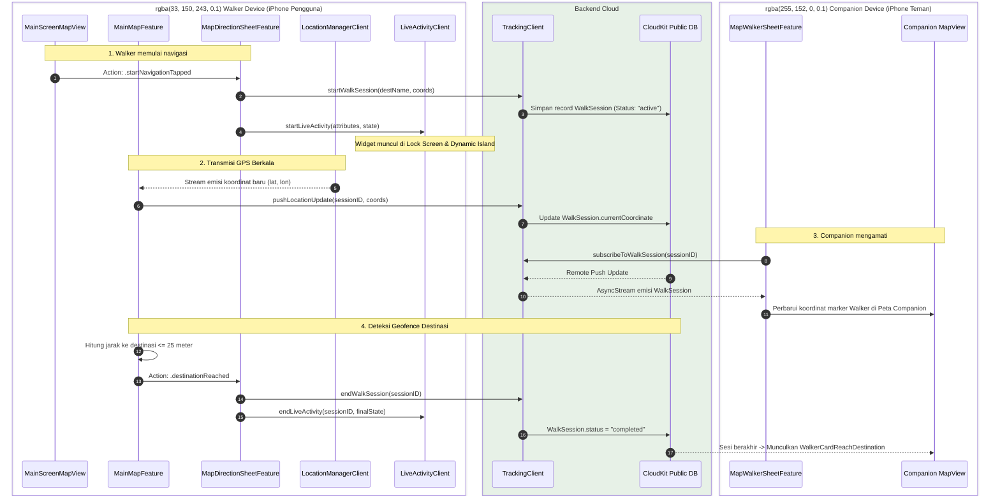

# 📚 Buku Panduan Kode & Teori Lengkap Proyek Astar (WalkGuard / Trail)
> **Target Pembaca**: Lulusan Ilmu Komputer (Computer Science) dengan latar belakang Python yang ingin memahami arsitektur sistem, teori bahasa Swift, filosofi functional programming dalam The Composable Architecture (TCA), serta penjelasan mendalam tiap file pada proyek ini.

---

## DAFTAR ISI
1. [Jembatan Konseptual: Dari Python ke Swift & TCA](#1-jembatan-konseptual-dari-python-ke-swift--tca)
2. [Teori Arsitektur Sistem: State Machine & Unidirectional Data Flow](#2-teori-arsitektur-sistem-state-machine--unidirectional-data-flow)
3. [Katalog & Bedah Mendalam Setiap File Kode](#3-katalog--bedah-mendalam-setiap-file-kode)
   - [3.1 Lapisan Bootstrap & Navigasi Utama (`App/`)](#31-lapisan-bootstrap--navigasi-utama-app)
   - [3.2 Fitur Inti Peta, Rute, & Pelacakan (`Features/Map/`)](#32-fitur-inti-peta-rute--pelacakan-featuresmap)
   - [3.3 Modul Pendamping & Wali (`Features/Guardian/`)](#33-modul-pendamping--wali-featuresguardian)
   - [3.4 Modul Autentikasi & Akun (`Features/Login/` & `Features/Onboarding/`)](#34-modul-autentikasi--akun-featureslogin--featuresonboarding)
   - [3.5 Modul Profil & Jejaring Tepercaya (`Features/Profile/`)](#35-modul-profil--jejaring-tepercaya-featuresprofile)
   - [3.6 Integrasi OS & Suara (`Features/Intents/` & `Features/Navigation/`)](#36-integrasi-os--suara-featuresintents--featuresnavigation)
   - [3.7 Layanan Bersama & Sistem Periferal (`Shared/`)](#37-layanan-bersama--sistem-periferal-shared)
4. [Diagram Eksekusi Runtime (State & Call Flow Matrix)](#4-diagram-eksekusi-runtime-state--call-flow-matrix)
5. [Ringkasan Pola Desain (Design Patterns) yang Diterapkan](#5-ringkasan-pola-desain-design-patterns-yang-diterapkan)

---

## 1. Jembatan Konseptual: Dari Python ke Swift & TCA

Sebagai seorang sarjana Computer Science dengan keahlian Python, Anda terbiasa dengan bahasa dinamis (*dynamically typed*), *duck typing*, OOP klasik dengan pointer referensi (`id()`, `self`), *event loop* `asyncio`, serta pustaka web seperti FastAPI, Django, atau arsitektur Redux di frontend JS.

Swift dan ekosistem modern Apple memiliki sejumlah perbedaan filosofis mendasar:

| Konsep Python | Konsep Swift di Proyek Ini | Teori & Relevansi Computer Science |
| :--- | :--- | :--- |
| `class User: pass` | `struct User: Equatable, Sendable` | **Value Semantics vs Reference Semantics**. `struct` di Swift adalah *value type* yang disalin saat *assignment* / pemanggilan fungsi (dengan optimasi Copy-on-Write). Mencegah *unintended shared mutation* dan aman secara mutlak dalam konkurensi (*thread-safe*). |
| `class Status(Enum): IDLE = 1` | `enum Status { case idle, walking(sessionID: String) }` | **Algebraic Data Types (Sum Types / Tagged Unions)**. Enum di Swift dapat memiliki *Associated Values*. Bukan sekadar integer atau string, tapi state terdefinisi secara matematis. |
| `typing.Protocol` / ABC | `protocol Reducer`, `protocol View` | **Parametric Polymorphism & Protocol-Oriented Programming (POP)**. Swift tidak mengandalkan *heavy inheritance*, melainkan komposisi kapabilitas via *Protocols*. |
| `asyncio.Queue` / Generator `yield` | `AsyncStream<Element>` | **Asynchronous Sequences**. Pola Reactive/Pull-Push di mana konsumen `for await item in stream` memproses event asinkron tanpa *blocking*. |
| Threading Lock / `threading.Lock` | `actor LocationManagerActor` | **Actor Model (Carl Hewitt)**. Actor menjamin isolasi memori: hanya satu task yang dapat mengeksekusi state internal actor pada satu waktu, mengeliminasi *race conditions* pada level compiler. |
| `dict`, `None` | `Optional<T>` (`T?`), Pattern Matching | Keamanan tipe terhadap `NullPointerException` / `AttributeError: NoneType has no attribute`. Compiler memaksa developer melakukan *unwrapping* via `guard let` atau `if let`. |

---

## 2. Teori Arsitektur Sistem: State Machine & Unidirectional Data Flow

Proyek ini dibangun menggunakan **The Composable Architecture (TCA)** dari Point-Free. Dalam teori Computer Science:

1. **Deterministic Finite-State Automata (DFA / Mealy Machine):**
   - Aplikasi dimodelkan sebagai mesin status terpadu:
     $$\text{Reducer}: (\text{State}_t, \text{Action}) \to (\text{State}_{t+1}, \text{Effect})$$
   - `State` adalah memori internal mesin.
   - `Action` adalah input simbol transisi.
   - `Effect` adalah *side-effect* terisolasi (I/O, network, GPS) yang tidak boleh mengotori fungsi reduksi murni.

2. **Unidirectional Data Flow (UDF):**
   Data hanya mengalir satu arah: `View -> Action -> Reducer -> State -> View`. Tidak ada komponen UI yang diizinkan memutasi state secara langsung.

3. **Inversion of Control (IoC) via Dependencies:**
   Semua dependensi eksternal (CloudKit, Location GPS, LiveActivity) diabstraksikan menggunakan `@DependencyClient` dan macro `@Dependency`. Hal ini memungkinkan pengujian murni (*Unit Testing*) menggunakan mock tanpa menyentuh perangkat keras.

---

## 3. Katalog & Bedah Mendalam Setiap File Kode

Berikut adalah pembedahan struktural dan teoritis setiap file Swift di dalam proyek ini:

```
Astar/
├── App/
├── Features/
│   ├── Guardian/
│   ├── Intents/
│   ├── Login/
│   ├── Main/
│   ├── Map/
│   ├── Navigation/
│   ├── Onboarding/
│   └── Profile/
└── Shared/
```

---

### 3.1 Lapisan Bootstrap & Navigasi Utama (`App/`)

#### 1. [`AstarApp.swift`](file:///Users/nad/Developer/XCode/Astar/Astar/App/AstarApp.swift)
- **Peran & Kapan Dipanggil**: Entry point mutlak aplikasi. Diberi anotasi `@main`. Saat OS meluncurkan binary aplikasi, kode inilah yang pertama kali dieksekusi runtime iOS.
- **Teori & Cara Kerja**:
  - `@UIApplicationDelegateAdaptor(AppDelegate.self)` menghubungkan siklus hidup klasik UIKit (`AppDelegate`) ke siklus hidup modern deklaratif SwiftUI `App`.
  - Pada blok `init()`, membaca persistent storage lokal (`UserProfileStorage.load()`). Jika data login ditemukan, state awal langsung diset ke `.main(MainFeature.State(...))`; jika tidak, masuk ke `.onboarding(...)`.
  - Menginisialisasi `let store = StoreOf<RootFeature>`. Store ini menjadi *root state container* untuk seluruh hierarki modul aplikasi.
  - Menghubungkan *listener event global* seperti `onOpenURL` (Deep Link) dan `NotificationCenter` (Siri Intent).

#### 2. [`RootFeature.swift`](file:///Users/nad/Developer/XCode/Astar/Astar/App/RootFeature.swift)
- **Peran & Kapan Dipanggil**: Reducer tingkat tertinggi (*Root Finite State Machine*). Dipanggil oleh `AstarApp` untuk mengevaluasi transisi layar utama dan memproses event eksternal.
- **Teori & Cara Kerja**:
  - State dimodelkan menggunakan enum tagged union:
    ```swift
    enum State: Equatable {
      case onboarding(OnboardingFeature.State)
      case main(MainFeature.State)
    }
    ```
  - Operator reduksi `.ifCaseLet` menghubungkan *child reducer* (`OnboardingFeature` & `MainFeature`) ke root reducer.
  - Menangani aksi `.onboarding(.delegate(.loggedIn(profile)))`: mentransisikan state dari Onboarding ke Main secara mulus, sekaligus mengeksekusi *pending deep link* jika pengguna membuka link saat belum terautentikasi.
  - Menangani event `signedOut`: mengosongkan state dan mengembalikan layar ke `OnboardingFeature`.

#### 3. [`ContentView.swift`](file:///Users/nad/Developer/XCode/Astar/Astar/App/ContentView.swift)
- **Peran & Kapan Dipanggil**: Root View pembungkus UI. Dibuat langsung di dalam `WindowGroup` milik `AstarApp`.
- **Teori & Cara Kerja**:
  - Menerapkan *pattern matching* pada `store.state`.
  - Menggunakan `store.scope(state:action:)` untuk memangkas *bounding scope* store. Jika `store.state` adalah `.onboarding`, SwiftUI hanya me-render `OnboardingView`. Jika `.main`, me-render `MainScreenMapView`.
  - Mengurangi *render overhead* karena View hanya mendengarkan cabang state yang relevan baginya.

#### 4. [`AppDelegate.swift`](file:///Users/nad/Developer/XCode/Astar/Astar/App/AppDelegate/AppDelegate.swift)
- **Peran & Kapan Dipanggil**: Adapter sistem operasi untuk integrasi Push Notification APNs (Apple Push Notification service), interaksi silent notification CloudKit, dan actionable notifications.
- **Teori & Cara Kerja**:
  - Mengimplementasikan protokol `UIApplicationDelegate` dan `UNUserNotificationCenterDelegate`.
  - Mendaftarkan kategori notifikasi `WALK_INVITATION` dengan aksi interaktif: `ACCEPT_WALK_ACTION` (Accompany) dan `DISMISS_WALK_ACTION` (Dismiss).
  - Menerima `didReceiveRemoteNotification`: ketika CloudKit mengirimkan *silent push* bahwa ada sesi perjalanan baru atau pembaruan checkpoint, `AppDelegate` mendistribusikan sinyal ini ke TCA Store melalui `NotificationCenter`.

---

### 3.2 Fitur Inti Peta, Rute, & Pelacakan (`Features/Map/`)

#### Kategori: Clients / Adapters (Inversion of Control)
Lapisan ini mengisolasi akses perangkat keras dan layanan pihak ketiga:

1. [`LocationManagerClient.swift`](file:///Users/nad/Developer/XCode/Astar/Astar/Features/Map/Clients/LocationManagerClient.swift)
   - **Teori**: Membungkus framework `CoreLocation`. Menggunakan `@MainActor final class LocationManagerActor` untuk memastikan pemanggilan GPS dilakukan di thread UI, lalu diekspos sebagai `AsyncStream<CLLocationCoordinate2D>`.
   - **Peran**: Menyediakan aliran pembaruan koordinat latitude/longitude secara terus-menerus kepada sistem.

2. [`DirectionRouteClient.swift`](file:///Users/nad/Developer/XCode/Astar/Astar/Features/Map/Clients/DirectionRouteClient.swift)
   - **Teori**: Membungkus `MKDirections` Apple MapKit. Menghitung rute pejalan kaki (`.walking`) antara dua koordinat geografis.
   - **Peran**: Mengembalikan objek `MKRoute`, estimasi waktu tempuh (ETA), jarak dalam meter, serta `MKPolyline` yang akan digambar di atas peta.

3. [`PlaceSearchClient.swift`](file:///Users/nad/Developer/XCode/Astar/Astar/Features/Map/Clients/PlaceSearchClient.swift)
   - **Teori**: Menggunakan `MKLocalSearch.Request`. Melakukan *natural language spatial search* (misal: "Monas", "Mall", "Kopi").
   - **Peran**: Mengonversi string input pencarian menjadi array model `SavedPlace` beserta koordinat presisinya.

4. [`UsersClient.swift`](file:///Users/nad/Developer/XCode/Astar/Astar/Features/Map/Clients/UsersClient.swift)
   - **Teori**: Lapisan abstraksi pembacaan `CKRecord` bertipe `UserProfile` dari CloudKit Public Database.
   - **Peran**: Mengambil daftar seluruh pengguna terdaftar, status mereka (`Idle`, `Walking`, `Accompanying`), serta tautan sesi aktif.

#### Kategori: Reducer & State Management
Otak dari seluruh kalkulasi peta:

5. [`MainMapFeature.swift`](file:///Users/nad/Developer/XCode/Astar/Astar/Features/Map/MainMapFeature.swift)
   - **Teori**: Finite State Machine terkompleks di dalam aplikasi (lebih dari 1300 baris kode). Menampung state navigasi aktif, koordinat pengguna, koordinat Walker yang sedang diawasi, polyline rute, dan bottom sheet aktif.
   - **Peran**:
     - Memulai dan mendengarkan stream GPS dari `LocationManagerClient`.
     - Mengunggah koordinat pengguna ke CloudKit via `TrackingClient.pushLocationUpdate` saat pengguna adalah Walker.
     - Mengunduh koordinat via `subscribeToWalkSession` saat pengguna adalah Companion/Guardian.
     - Mengatur kamera peta (`MKCoordinateRegion`), deteksi pencapaian destinasi (geofencing radius), dan memicu penulisan *journey log* (papan jalan).

6. [`MapSheetFeature.swift`](file:///Users/nad/Developer/XCode/Astar/Astar/Features/Map/MapSheetFeature.swift)
   - **Teori**: Tagged union reducer (`enum MapSheetFeature`).
   - **Peran**: Mengatur konten modal / bottom sheet di atas peta: apakah sedang mode pencarian tempat (`.search`), persiapan & navigasi jalan (`.direction`), atau inspeksi profil pejalan kaki (`.walker`).

7. [`MapSearchSheetFeature.swift`](file:///Users/nad/Developer/XCode/Astar/Astar/Features/Map/MapSearchSheetFeature.swift)
   - **Teori**: State machine pencarian dengan algoritma **Debouncing** (300ms sleep) via `continuousClock`.
   - **Peran**: Mencegah *spamming API* pencarian setiap kali pengguna mengetik karakter baru di search bar.

8. [`MapDirectionSheetFeature.swift`](file:///Users/nad/Developer/XCode/Astar/Astar/Features/Map/MapDirectionSheetFeature.swift)
   - **Teori**: Mengelola state *lifecycle* navigasi Walker: `.directions` (pratinjau), `.progress` (sedang berjalan), dan `.journeyLog` (riwayat jalan yang dilewati).
   - **Peran**: Memulai sesi di CloudKit, memperbarui status pengguna menjadi `"walking"`, menyiarkan Live Activity ke Lock Screen, dan menyelesaikan sesi saat tiba.

9. [`MapWalkerSheetFeature.swift`](file:///Users/nad/Developer/XCode/Astar/Astar/Features/Map/MapWalkerSheetFeature.swift)
   - **Teori**: Mengelola sudut pandang Companion ketika memilih seorang teman di peta.
   - **Peran**: Mengambil metadata sesi berjalan aktif Walker dari CloudKit, menampilkan riwayat perjalanan masa lalu, dan menyediakan tombol aksi "Accompany" untuk bergabung menjadi pengawas.

#### Kategori: Model & Ekstensi
10. [`MapPlaceModels.swift`](file:///Users/nad/Developer/XCode/Astar/Astar/Features/Map/Models/MapPlaceModels.swift) & [`DirectionJourneyLogModels.swift`](file:///Users/nad/Developer/XCode/Astar/Astar/Features/Map/Models/DirectionJourneyLogModels.swift): Data structures (DTO) untuk lokasi, tempat tersimpan, dan entri log jalan (*milestones*).
11. [`Map+Equatable.swift`](file:///Users/nad/Developer/XCode/Astar/Astar/Features/Map/Map+Equatable.swift) & [`MapModels+Equatable.swift`](file:///Users/nad/Developer/XCode/Astar/Astar/Features/Map/MapModels+Equatable.swift): Mengimplementasikan protokol `Equatable` untuk tipe-tipe MapKit (`MKRoute`, `CLLocationCoordinate2D`, `MKPolyline`) agar TCA dapat melakukan *diffing state* secara efisien.

#### Kategori: Komponen UI Tampilan (`Components/` & `View/`)
12. [`MainScreenMapView.swift`](file:///Users/nad/Developer/XCode/Astar/Astar/Features/Map/View/MainScreenMapView.swift): Tampilan utama SwiftUI yang membungkus komponen peta interaktif MapKit, overlay dynamic island, dan sheet controller.
13. Sub-komponen Search: [`SearchBarView.swift`](file:///Users/nad/Developer/XCode/Astar/Astar/Features/Map/Components/Search/SearchBarView.swift), [`ActiveSearchBarView.swift`](file:///Users/nad/Developer/XCode/Astar/Astar/Features/Map/Components/Search/ActiveSearchBarView.swift), [`SearchResultsCard.swift`](file:///Users/nad/Developer/XCode/Astar/Astar/Features/Map/Components/Search/SearchResultsCard.swift), [`SearchResultRow.swift`](file:///Users/nad/Developer/XCode/Astar/Astar/Features/Map/Components/Search/SearchResultRow.swift), [`CancelSearchButton.swift`](file:///Users/nad/Developer/XCode/Astar/Astar/Features/Map/Components/Search/CancelSearchButton.swift).
14. Sub-komponen Direction & Card: [`DirectionCard.swift`](file:///Users/nad/Developer/XCode/Astar/Astar/Features/Map/Components/Direction/DirectionCard.swift), [`DirectionProgress.swift`](file:///Users/nad/Developer/XCode/Astar/Astar/Features/Map/Components/Direction/DirectionProgress.swift), [`DirectionJourneyLog.swift`](file:///Users/nad/Developer/XCode/Astar/Astar/Features/Map/Components/Direction/DirectionJourneyLog.swift), [`DirectionJourneyLogCard.swift`](file:///Users/nad/Developer/XCode/Astar/Astar/Features/Map/Components/Direction/DirectionJourneyLogCard.swift), [`DirectionJourneyLogRow.swift`](file:///Users/nad/Developer/XCode/Astar/Astar/Features/Map/Components/Direction/DirectionJourneyLogRow.swift), [`DirectionPersonView.swift`](file:///Users/nad/Developer/XCode/Astar/Astar/Features/Map/Components/Direction/DirectionPersonView.swift), [`DirectionRow.swift`](file:///Users/nad/Developer/XCode/Astar/Astar/Features/Map/Components/Direction/DirectionRow.swift).
15. Sub-komponen Sheet & Overlays: [`MapSheet.swift`](file:///Users/nad/Developer/XCode/Astar/Astar/Features/Map/Components/Sheet/MapSheet.swift), [`MapSheetMainContent.swift`](file:///Users/nad/Developer/XCode/Astar/Astar/Features/Map/Components/Sheet/MapSheetMainContent.swift), [`MapSheetSearchContent.swift`](file:///Users/nad/Developer/XCode/Astar/Astar/Features/Map/Components/Sheet/MapSheetSearchContent.swift), [`MapSheetDirectionContent.swift`](file:///Users/nad/Developer/XCode/Astar/Astar/Features/Map/Components/Sheet/MapSheetDirectionContent.swift), [`BroadcastInfoSheet.swift`](file:///Users/nad/Developer/XCode/Astar/Astar/Features/Map/Components/Sheet/BroadcastInfoSheet.swift).
16. Sub-komponen People & Places: [`PeopleSection.swift`](file:///Users/nad/Developer/XCode/Astar/Astar/Features/Map/Components/People/PeopleSection.swift), [`PersonView.swift`](file:///Users/nad/Developer/XCode/Astar/Astar/Features/Map/Components/People/PersonView.swift), [`SavedSection.swift`](file:///Users/nad/Developer/XCode/Astar/Astar/Features/Map/Components/Places/SavedSection.swift), [`SavedPlacesCard.swift`](file:///Users/nad/Developer/XCode/Astar/Astar/Features/Map/Components/Places/SavedPlacesCard.swift), [`SavedPlaceRow.swift`](file:///Users/nad/Developer/XCode/Astar/Astar/Features/Map/Components/Places/SavedPlaceRow.swift), [`NoResultsView.swift`](file:///Users/nad/Developer/XCode/Astar/Astar/Features/Map/Components/Places/NoResultsView.swift), [`ProfileButton.swift`](file:///Users/nad/Developer/XCode/Astar/Astar/Features/Map/Components/Profile/ProfileButton.swift).
17. Sub-komponen Dynamic Island In-App: [`FloatingDynamicIslandOverlay.swift`](file:///Users/nad/Developer/XCode/Astar/Astar/Features/Map/Components/DynamicIsland/FloatingDynamicIslandOverlay.swift), [`DynamicIslandGoogleMapsView.swift`](file:///Users/nad/Developer/XCode/Astar/Astar/Features/Map/Components/DynamicIsland/DynamicIslandGoogleMapsView.swift): Visualisasi indikator mengambang menyerupai Dynamic Island di dalam peta aplikasi.

---

### 3.3 Modul Pendamping & Wali (`Features/Guardian/`)

Modul ini khusus merender kartu informasi detail ketika pengguna sedang memantau orang lain (mode Guardian/Companion).

1. [`WalkerModels.swift`](file:///Users/nad/Developer/XCode/Astar/Astar/Features/Guardian/Models/WalkerModels.swift): Struktur data profil pejalan kaki, status (`available`, `walking`, `arrived`), dan riwayat perjalanan lampau (`WalkerHistoryTrip`).
2. [`WalkerProfileHeader.swift`](file:///Users/nad/Developer/XCode/Astar/Astar/Features/Guardian/Components/WalkerProfileHeader.swift): Menampilkan foto avatar, nama pejalan kaki, dan status baterai/sinyal.
3. [`WalkerStatusSection.swift`](file:///Users/nad/Developer/XCode/Astar/Astar/Features/Guardian/Components/WalkerStatusSection.swift): Badge visual status pengguna (misal: warna hijau untuk "Idle", oranye/biru untuk "Walking").
4. [`WalkerCardWalking.swift`](file:///Users/nad/Developer/XCode/Astar/Astar/Features/Guardian/Components/WalkerCardWalking.swift): Kartu utama saat walker sedang aktif berjalan, menampilkan tombol "Accompany" atau "Stop Watching".
5. [`WalkerCardIdle.swift`](file:///Users/nad/Developer/XCode/Astar/Astar/Features/Guardian/Components/WalkerCardIdle.swift): Kartu yang tampil saat orang tersebut sedang diam/tidak ada sesi aktif.
6. [`WalkerCardRoute.swift`](file:///Users/nad/Developer/XCode/Astar/Astar/Features/Guardian/Components/WalkerCardRoute.swift): Menampilkan titik asal dan tujuan pejalan kaki.
7. [`WalkerCardReachDestination.swift`](file:///Users/nad/Developer/XCode/Astar/Astar/Features/Guardian/Components/WalkerCardReachDestination.swift): Tampilan perayaan/notifikasi aman ketika pejalan kaki telah sampai di lokasi tujuan dengan selamat.
8. [`WalkerCardHistoryList.swift`](file:///Users/nad/Developer/XCode/Astar/Astar/Features/Guardian/Components/WalkerCardHistoryList.swift) & [`WalkerCardHistoryDetail.swift`](file:///Users/nad/Developer/XCode/Astar/Astar/Features/Guardian/Components/WalkerCardHistoryDetail.swift): Tampilan riwayat rute-rute yang pernah ditempuh sebelumnya.
9. [`WalkerCardRecentLocations.swift`](file:///Users/nad/Developer/XCode/Astar/Astar/Features/Guardian/Components/WalkerCardRecentLocations.swift): Tampilan lokasi-lokasi persinggahan terakhir.

---

### 3.4 Modul Autentikasi & Akun (`Features/Login/` & `Features/Onboarding/`)

1. [`OnboardingFeature.swift`](file:///Users/nad/Developer/XCode/Astar/Astar/Features/Onboarding/OnboardingFeature.swift):
   - **Teori**: State machine navigasi carousel layar perkenalan (*carousel pager*).
   - **Peran**: Menyimpan teks edukasi fitur (WalkGuard, Walker & Guardian, Default Place). Memfasilitasi penyimpanan `pendingDeepLink` jika user masuk via URL intent sebelum melewati onboarding.
2. [`OnboardingView.swift`](file:///Users/nad/Developer/XCode/Astar/Astar/Features/Onboarding/OnboardingView.swift):
   - **Peran**: UI deklaratif berbasis `TabView(selection:)` dengan style `PageTabViewStyle` untuk swipe antar-halaman, serta tombol Sign in with Apple di halaman terakhir.
3. [`LoginFeature.swift`](file:///Users/nad/Developer/XCode/Astar/Astar/Features/Login/LoginFeature.swift):
   - **Teori**: Otentikasi terdesentralisasi Apple ID via framework `AuthenticationServices`.
   - **Peran**: Menangani token `ASAuthorizationAppleIDCredential`, mengekstrak User Identifier unik, lalu membuat atau memperbarui record `UserProfile` di CloudKit Public Database.

---

### 3.5 Modul Profil & Jejaring Tepercaya (`Features/Profile/`)

1. [`ProfileFeature.swift`](file:///Users/nad/Developer/XCode/Astar/Astar/Features/Profile/ProfileFeature.swift):
   - **Peran**: Reducer pengatur informasi akun pengguna, toggle mode pengembang (*developer settings*), penggantian avatar melalui kontak lokal, dan tombol logout.
2. [`ProfileView.swift`](file:///Users/nad/Developer/XCode/Astar/Astar/Features/Profile/ProfileView.swift): Tampilan UI menu profil pengguna.
3. [`Model.swift`](file:///Users/nad/Developer/XCode/Astar/Astar/Features/Profile/Model.swift): Definisi struct `UserProfile` yang kompatibel dengan CloudKit `CKRecord`.
4. [`DeveloperSettingsStorage.swift`](file:///Users/nad/Developer/XCode/Astar/Astar/Features/Profile/DeveloperSettingsStorage.swift):
   - **Teori**: Simpanan konfigurasi lokal berbasis `UserDefaults`.
   - **Peran**: Flag untuk debugging: `isDevelopmentMode`, `isShowRouteGuide`, dan `isDoeWalkingMockEnabled` (simulasi pejalan kaki virtual tanpa harus berjalan di luar ruangan).
5. [`SavedPlacesFeature.swift`](file:///Users/nad/Developer/XCode/Astar/Astar/Features/Profile/SavedPlacesFeature.swift), [`SavedPlacesView.swift`](file:///Users/nad/Developer/XCode/Astar/Astar/Features/Profile/SavedPlacesView.swift), [`SavedPlacesRepository.swift`](file:///Users/nad/Developer/XCode/Astar/Astar/Features/Profile/SavedPlacesRepository.swift), [`SavedPlacesStorage.swift`](file:///Users/nad/Developer/XCode/Astar/Astar/Features/Profile/SavedPlacesStorage.swift):
   - **Teori**: Repository pattern untuk CRUD lokasi favorit (Home, Office). Disimpan di `UserDefaults` dengan serialisasi JSON.

#### Sub-modul Trusted Person (Jejaring Sosial Keamanan)
6. [`TrustedPersonFeature.swift`](file:///Users/nad/Developer/XCode/Astar/Astar/Features/Profile/TrustedPerson/TrustedPersonFeature.swift):
   - **Peran**: Mengelola daftar relasi pertemanan. Memilah koneksi menjadi `mutualConnections` (saling menyetujui) dan `requestConnections` (permintaan menunggu verifikasi).
7. [`TrustedPersonView.swift`](file:///Users/nad/Developer/XCode/Astar/Astar/Features/Profile/TrustedPerson/TrustedPersonView.swift): Tampilan UI daftar orang tepercaya.
8. [`AddTrustedPersonFeature.swift`](file:///Users/nad/Developer/XCode/Astar/Astar/Features/Profile/TrustedPerson/AddTrustedPersonFeature.swift) & [`AddTrustedPersonView.swift`](file:///Users/nad/Developer/XCode/Astar/Astar/Features/Profile/TrustedPerson/AddTrustedPersonView.swift): Fitur mencari pengguna lain di sistem dan mengirim permintaan koneksi (*friend request*).
9. [`RequestTrustedPersonFeature.swift`](file:///Users/nad/Developer/XCode/Astar/Astar/Features/Profile/TrustedPerson/RequestTrustedPersonFeature.swift) & [`RequestTrustedPersonView.swift`](file:///Users/nad/Developer/XCode/Astar/Astar/Features/Profile/TrustedPerson/RequestTrustedPersonView.swift): Menyetujui (*accept*) atau menolak (*reject*) permintaan pertemanan yang masuk.

---

### 3.6 Integrasi OS & Suara (`Features/Intents/` & `Features/Navigation/`)

1. [`AlwaysHomeIntent.swift`](file:///Users/nad/Developer/XCode/Astar/Astar/Features/Intents/AlwaysHomeIntent.swift):
   - **Teori**: Implementasi protokol `AppIntent` (iOS 16+).
   - **Peran**: Mengekspos fungsi "Always Home" ke sistem operasi Apple. Saat dipicu lewat Siri, intent memancarkan notifikasi internal `.startAlwaysHomeNavigation`.
2. [`NavigateOfficeIntent.swift`](file:///Users/nad/Developer/XCode/Astar/Astar/Features/Intents/NavigateOfficeIntent.swift) & [`NavigateAgoraMallIntent.swift`](file:///Users/nad/Developer/XCode/Astar/Astar/Features/Intents/NavigateAgoraMallIntent.swift): Intent siap pakai untuk rute cepat ke kantor atau pusat perbelanjaan.
3. [`AstarAppShortcutsProvider.swift`](file:///Users/nad/Developer/XCode/Astar/Astar/Features/Intents/AstarAppShortcutsProvider.swift): Mendaftarkan frasa suara default seperti *"Walk home with Trail"* ke aplikasi Shortcuts iOS tanpa perlu konfigurasi manual dari user.
4. [`DeepLinkHandler.swift`](file:///Users/nad/Developer/XCode/Astar/Astar/Features/Navigation/DeepLinkHandler.swift):
   - **Teori**: URL parser berbasis `URLComponents`.
   - **Peran**: Mengonversi skema custom URL `astar://navigate?destination=Home` menjadi enum Swift `DeepLink.navigate(destination: "Home")`.

---

### 3.7 Layanan Bersama & Sistem Periferal (`Shared/`)

#### Sub-sistem CloudKit Database
1. [`TrackingClient.swift`](file:///Users/nad/Developer/XCode/Astar/Astar/Shared/CloudKit/TrackingClient.swift):
   - **Teori**: Client database serverless terlengkap di proyek ini. Berisi implementasi penuh CRUD record CloudKit:
     - `WalkSession`: Menyimpan sesi aktif, koordinat saat ini, polyline, status, waktu ping terakhir.
     - `SessionParticipant`: Mencatat relasi antara Walker dan Guardian yang sedang menonton.
     - `JourneyLog`: Papan nama jalan dan timestamp yang berhasil dilalui.
   - **Fitur Khusus**: Menyediakan method streaming reaktif `subscribeToWalkSession` dan `subscribeToJourneyLogs` yang mengubah event push CloudKit menjadi `AsyncStream`.
2. [`ConnectionsClient.swift`](file:///Users/nad/Developer/XCode/Astar/Astar/Shared/CloudKit/ConnectionsClient.swift):
   - **Peran**: Menangani pembuatan query relasi dua arah antar-pengguna (`Connection`) di CloudKit menggunakan `CKQuery` dan `NSPredicate`.

#### Sub-sistem Widget & Dynamic Island (`ActivityKit`)
3. [`TrailWalkAttributes.swift`](file:///Users/nad/Developer/XCode/Astar/Astar/Shared/ActivityKit/TrailWalkAttributes.swift):
   - **Teori**: Mendefinisikan schema protokol `ActivityAttributes`.
   - **Peran**: Membagi data menjadi:
     - *Static Attributes*: Nama tujuan, icon tujuan, ID sesi.
     - *Dynamic ContentState*: Estimasi waktu tiba (ETA), sisa jarak dalam meter, persentase progres rute, dan nama jalan terkini.
4. [`TrailLiveActivityWidget.swift`](file:///Users/nad/Developer/XCode/Astar/Astar/Shared/ActivityKit/TrailLiveActivityWidget.swift):
   - **Peran**: Template UI Widget SwiftUI yang di-render oleh iOS di Lock Screen dan lubang Dynamic Island (tampilan ringkas, minimalis, dan ekspansi).
5. [`LiveActivityClient.swift`](file:///Users/nad/Developer/XCode/Astar/Astar/Shared/ActivityKit/LiveActivityClient.swift):
   - **Peran**: TCA Dependency Client untuk memanggil lifecycle `Activity.request`, `activity.update`, dan `activity.end`.

#### Sub-sistem Apple Watch (`WatchConnectivity`)
6. [`WatchModels.swift`](file:///Users/nad/Developer/XCode/Astar/Astar/Shared/WatchConnectivity/WatchModels.swift): Data model serializable untuk dikirim melalui Bluetooth/Wi-Fi ke Apple Watch.
7. [`WatchConnectivityClient.swift`](file:///Users/nad/Developer/XCode/Astar/Astar/Shared/WatchConnectivity/WatchConnectivityClient.swift):
   - **Teori**: Membungkus `WCSession` dan delegate-nya menjadi interface async/stream modern yang kompatibel dengan TCA.

#### Sub-sistem Kontak Lokal
8. [`ContactPhotoClient.swift`](file:///Users/nad/Developer/XCode/Astar/Astar/Shared/Contacts/ContactPhotoClient.swift):
   - **Peran**: Membaca buku alamat lokal perangkat (`CNContactStore`) untuk mengambil foto profil pengguna berdasarkan email atau nama lengkap secara offline.

---

## 4. Diagram Eksekusi Runtime (State & Call Flow Matrix)

Diagram berikut memetakan bagaimana komponen-komponen di atas saling bertukar sinyal saat sesi navigasi real-time berjalan:



---

## 5. Ringkasan Pola Desain (Design Patterns) yang Diterapkan

Bagi Anda yang terbiasa dengan literatur *Design Patterns (Gang of Four)* dan arsitektur piranti lunak enterprise, berikut pola-pola yang diimplementasikan di proyek ini:

1. **Unidirectional State Architecture (Redux / Elm Pattern):**
   Memastikan tidak ada konflik perubahan status bersama (*race conditions*) melalui struktur reducer murni.
2. **Repository & Adapter Pattern:**
   `SavedPlacesStorage`, `TrackingClient`, dan `LocationManagerClient` bertindak sebagai adapter yang mengisolasi kode bisnis inti dari detail teknis iOS SDK / CloudKit.
3. **Observer & Reactive Streams Pattern:**
   Penggunaan `AsyncStream` dan Combine `NotificationCenter.Publisher` untuk mengalirkan update lokasi, deep link, dan pesan Apple Watch.
4. **Command / Intent Pattern:**
   Framework `AppIntent` memodelkan tindakan pengguna ("Navigate Home") sebagai objek terpisah yang dapat dipanggil dari berbagai konteks (Siri, Spotlight, URL).
5. **Tagged Union / Algebraic Data Modeling:**
   Penggunaan `enum` Swift untuk memodelkan seluruh status domain dan event secara *exhaustive*, menjamin saat compile-time bahwa tidak ada skenario state yang terlewat tanpa ditangani.
