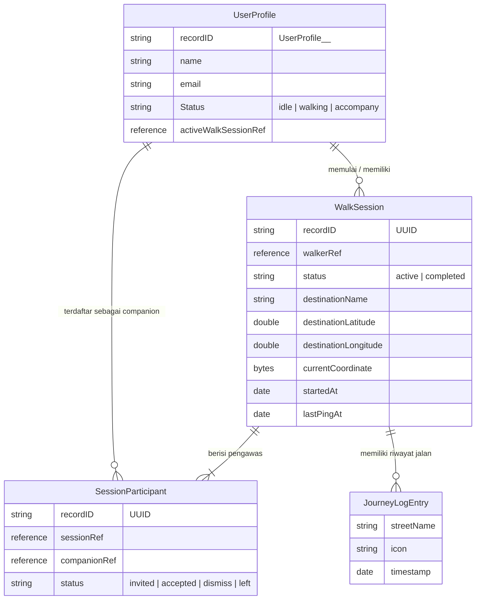
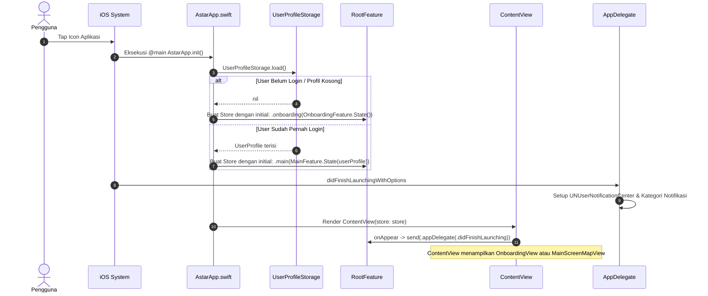
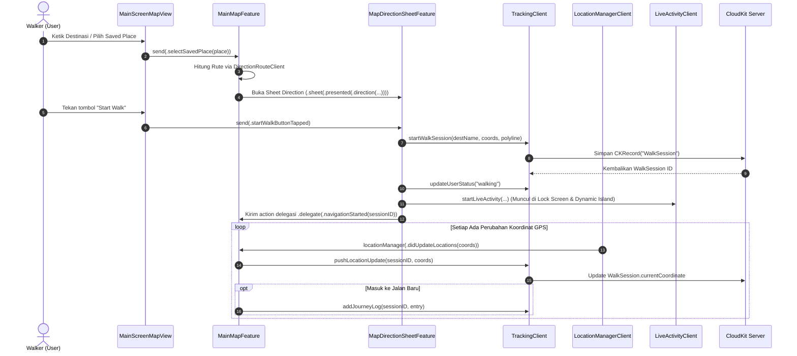
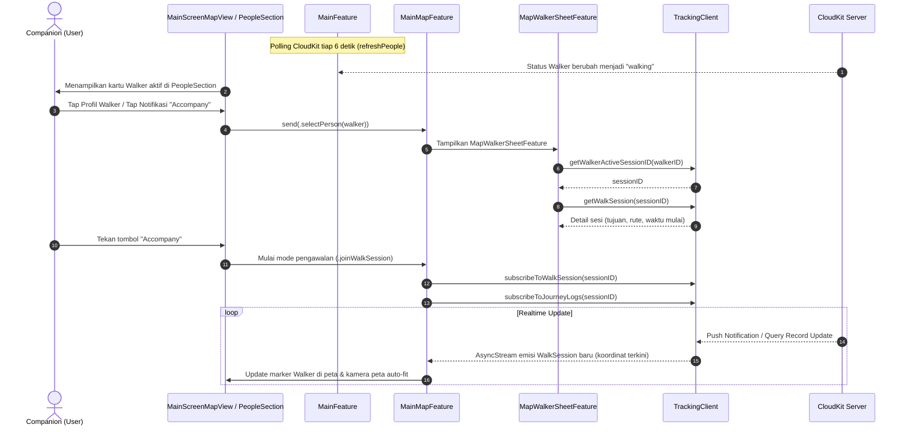

# Panduan Komprehensif Arsitektur & Alur Sistem Astar (WalkGuard / Trail)

Dokumen ini ditujukan bagi developer berlatar belakang IT / Software Engineering yang **baru pertama kali mendalami Swift, SwiftUI, dan The Composable Architecture (TCA)**. Panduan ini mengupas tuntas struktur proyek, konsep dasar teknologi yang digunakan, serta siklus hidup dan aliran data (*call flow*) dari awal aplikasi dijalankan hingga fitur pelacakan berjalan.

---

## Daftar Isi
1. [Ringkasan Proyek & Domain Bisnis](#1-ringkasan-proyek--domain-bisnis)
2. [Prinsip Dasar Swift & SwiftUI untuk Pemula](#2-prinsip-dasar-swift--swiftui-untuk-pemula)
3. [Memahami The Composable Architecture (TCA)](#3-memahami-the-composable-architecture-tca)
4. [Struktur Folder & Peta Komponen](#4-struktur-folder--peta-komponen)
5. [Ekosistem CloudKit & Sinkronisasi Data](#5-ekosistem-cloudkit--sinkronisasi-data)
6. [Fitur-Fitur Khusus Ekosistem Apple](#6-fitur-fitur-khusus-ekosistem-apple)
7. [Alur Eksekusi Aplikasi (*Runtime Call Flow*)](#7-alur-eksekusi-aplikasi-runtime-call-flow)
    - [7.1 Siklus Bootstrapping (Saat Aplikasi Baru Dibuka)](#71-siklus-bootstrapping-saat-aplikasi-baru-dibuka)
    - [7.2 Skenario: Pejalan Kaki (Walker) Memulai Perjalanan](#72-skenario-pejalan-kaki-walker-memulai-perjalanan)
    - [7.3 Skenario: Pendamping (Companion / Guardian) Mengikuti Perjalanan](#73-skenario-pendamping-companion--guardian-mengikuti-perjalanan)
    - [7.4 Skenario: Integrasi Deep Link & Siri / App Shortcuts](#74-skenario-integrasi-deep-link--siri--app-shortcuts)
8. [Debugging & Strategi Testing](#8-debugging--strategi-testing)
9. [Glosarium Istilah Penting](#9-glosarium-istilah-penting)

---

## 1. Ringkasan Proyek & Domain Bisnis

Aplikasi ini (diberi nama proyek internal `Astar`, dengan nama produk **Trail** atau **WalkGuard**) adalah aplikasi keselamatan perjalanan pejalan kaki berbasis iOS dan Apple Watch.

### Aktor Utama:
1. **Walker (Pejalan Kaki):** Pengguna yang berjalan kaki menuju destinasi tertentu. Aplikasi akan:
   - Mencari rute pejalan kaki via Apple MapKit.
   - Menyiarkan (*broadcast*) koordinat GPS, progres rute, dan log jalan ke CloudKit Database.
   - Mengaktifkan **Live Activity & Dynamic Island** di iPhone dan mentransmisikan data ke **Apple Watch** via WatchConnectivity.
2. **Guardian / Companion (Pendamping):** Kontak tepercaya (*trusted person*) yang mengawasi perjalanan Walker secara *real-time*. Mereka dapat menerima notifikasi push undangan berjalan, melihat posisi live Walker di peta, serta memeriksa log riwayat jalan.

---

## 2. Prinsip Dasar Swift & SwiftUI untuk Pemula

Bagi Anda yang terbiasa dengan bahasa seperti TypeScript, JavaScript, Python, Kotlin, Java, atau Go, berikut pemetaan konsep dasar Swift:

1. **Struct vs Class:**
   - `struct` di Swift adalah *Value Type* (disalin saat dipassing). SwiftUI dan TCA banyak menggunakan `struct` untuk membuat View dan State karena sifatnya yang *immutable* secara default dan aman dari *data races*.
   - `class` adalah *Reference Type* (berbagi pointer memori yang sama), digunakan terutama pada layer integrasi seperti [`AppDelegate`](file:///Users/nad/Developer/XCode/Astar/Astar/App/AppDelegate/AppDelegate.swift).
2. **Swift Concurrency (`async/await`, `AsyncStream`):**
   - Menggunakan model *cooperative multitasking*.
   - `AsyncStream` serupa dengan Reactive Streams / Rx Observable / Event Emitter; memungkinkan konsumen mendengarkan urutan data asinkron tanpa memblokir thread.
3. **SwiftUI (`View` & `@Binding`):**
   - UI bersifat deklaratif: UI adalah fungsi dari State (`UI = f(State)`).
   - Ketika properti state berubah, SwiftUI secara otomatis mengkomputasi ulang tampilan body (`var body: some View`).

---

## 3. Memahami The Composable Architecture (TCA)

Aplikasi ini menggunakan pustaka **The Composable Architecture (TCA)** dari Point-Free (versi modern dengan macro `@Reducer` dan `@ObservableState`).

Jika Anda familiar dengan **Redux, Elm, Flux, atau MVI (Model-View-Intent)**, konsep TCA akan sangat mudah dipahami:

```mermaid
flowchart LR
    View["SwiftUI View\n(Tampilan UI)"]
    Action["Action\n(Enum Event/Intensi)"]
    Reducer["Reducer\n(Logika State & Effect)"]
    State["State\n(Single Source of Truth)"]
    Effect["Dependencies / Effects\n(CloudKit, GPS, API)"]

    View -->|1. store.send(action)| Action
    Action -->|2. Diterima oleh| Reducer
    Reducer -->|3. Mutasi murni| State
    State -->|4. Re-render otomatis| View
    Reducer -->|5. Memicu async task| Effect
    Effect -->|6. Mengirim Action kembali| Action
```

### 4 Pilar Utama TCA:

| Elemen | Definisi & Analoginya | Contoh di Kode Proyek |
| :--- | :--- | :--- |
| **State** | Data/kondisi UI saat ini. Bersifat murni (*value type*). | [`MainMapFeature.State`](file:///Users/nad/Developer/XCode/Astar/Astar/Features/Map/MainMapFeature.swift#L11-L56) menyimpan `currentLocation`, `isNavigating`, `activeRoute`, dll. |
| **Action** | Semua peristiwa yang bisa terjadi: interaksi pengguna, timer, respon network, delegate. Didefinisikan dalam `enum`. | [`MainMapFeature.Action`](file:///Users/nad/Developer/XCode/Astar/Astar/Features/Map/MainMapFeature.swift#L58-L90) seperti `.searchTapped`, `.startAlwaysHomeNavigation`, `.walkSessionUpdated`. |
| **Reducer** | Fungsi murni yang mengambil `State` saat ini dan `Action`, mengubah `State`, lalu mengembalikan `Effect` (jika ada pekerjaan asinkron). | Blok `Reduce { state, action in ... }` di setiap file feature. |
| **Store** | Objek runtime yang mengikat State, Reducer, dan UI secara reaktif. | [`ContentView(store: store)`](file:///Users/nad/Developer/XCode/Astar/Astar/App/ContentView.swift#L12). |

### Konsep TCA Spesifik yang Digunakan di Proyek Ini:
1. **`Scope`:** Membagi state dan action besar menjadi modul-modul kecil. Contoh di [`MainFeature.swift`](file:///Users/nad/Developer/XCode/Astar/Astar/Features/Main/MainFeature.swift#L66-L72):
   ```swift
   Scope(state: \.map, action: \.map) {
     MainMapFeature()
   }
   ```
2. **Navigation Stack (`StackState` & `StackAction`):** Digunakan untuk navigasi berbasis tumpukan (*push-pop*). Contoh: [`MainFeature.Path`](file:///Users/nad/Developer/XCode/Astar/Astar/Features/Main/MainFeature.swift#L8-L14) mengelola navigasi ke Profile, Saved Places, dan Trusted Person.
3. **Modals & Sheets (`@Presents` & `PresentationAction`):** Mengontrol kemunculan Bottom Sheet (`MapSheetFeature`). Jika nil, sheet tertutup; jika terisi, sheet terbuka.
4. **Dependencies Injection (`@Dependency`):** Abstraksi layanan eksternal (GPS, database, kontak) agar mudah di-mock dalam testing tanpa koneksi internet atau hardware asli. Contoh: `@Dependency(\.trackingClient) var trackingClient`.

---

## 4. Struktur Folder & Peta Komponen

```
Astar/
├── App/                         # Entry point aplikasi & lifecycle iOS
│   ├── AstarApp.swift           # Inisialisasi awal, Root Store, event URL/DeepLink
│   ├── ContentView.swift        # Root router (beralih antara Onboarding atau Main)
│   ├── RootFeature.swift        # TCA Reducer tingkat paling atas (Root)
│   └── AppDelegate/             # Handler Push Notification & background task iOS
├── Features/                    # Domain-driven features (modul bisnis)
│   ├── Onboarding/              # Layar perkenalan saat pertama kali buka / belum login
│   ├── Login/                   # Otentikasi Sign In with Apple & registrasi profil
│   ├── Main/                    # Modul sentral pembungkus Peta & navigasi profil
│   ├── Map/                     # Inti logika pemetaan & navigasi
│   │   ├── Clients/             # Dependency: GPS (LocationManagerClient), Rute (DirectionRouteClient), dsb.
│   │   ├── Components/          # Komponen UI: Search bar, Direction card, People section
│   │   ├── Models/              # Struct data: MapPlace, SavedPlace, WalkingRouteInfo
│   │   ├── View/                # MainScreenMapView.swift (Render MapKit SwiftUI)
│   │   ├── MainMapFeature.swift # Otak kalkulasi peta dan pelacakan GPS
│   │   ├── MapSheetFeature.swift# Pengendali tipe sheet yang aktif (Search/Direction/Walker)
│   │   └── MapDirectionSheetFeature.swift # Mengatur proses perjalanan walker aktif
│   ├── Guardian/                # Komponen dan tampilan kartu untuk Companion / Guardian
│   ├── Profile/                 # Pengaturan user, Saved Places, & Trusted Person (Keluarga/Teman)
│   ├── Intents/                 # Siri Shortcuts & App Intents ("Hey Siri, Always Home")
│   └── Navigation/              # Parser Deep Link URL (misal: astar://navigate?destination=...)
└── Shared/                      # Infrastruktur lintas modul
    ├── CloudKit/                # TrackingClient.swift & ConnectionsClient.swift (Database Sync)
    ├── ActivityKit/             # Live Activity & Dynamic Island (Lock Screen widget)
    ├── WatchConnectivity/       # Komunikasi dua arah ke Apple Watch
    └── Contacts/                # Integrasi kontak lokal iOS untuk memilih trusted person
```

---

## 5. Ekosistem CloudKit & Sinkronisasi Data

Aplikasi ini menggunakan **Apple CloudKit Public Database** sebagai backend tanpa server khusus (*serverless*).



### File Kunci:
- [`TrackingClient.swift`](file:///Users/nad/Developer/XCode/Astar/Astar/Shared/CloudKit/TrackingClient.swift): Menangani pembuatan record `WalkSession`, pengiriman ping koordinat real-time (`pushLocationUpdate`), penambahan checkpoint (`addJourneyLog`), dan langganan stream data (`subscribeToWalkSession`, `subscribeToJourneyLogs`).
- [`UsersClient.swift`](file:///Users/nad/Developer/XCode/Astar/Astar/Features/Map/Clients/UsersClient.swift): Mengambil daftar semua pengguna di CloudKit untuk mengisi list `PeopleSection`.

---

## 6. Fitur-Fitur Khusus Ekosistem Apple

1. **ActivityKit (Live Activity & Dynamic Island):**
   - File: [`LiveActivityClient.swift`](file:///Users/nad/Developer/XCode/Astar/Astar/Shared/ActivityKit/LiveActivityClient.swift), [`TrailLiveActivityWidget.swift`](file:///Users/nad/Developer/XCode/Astar/Astar/Shared/ActivityKit/TrailLiveActivityWidget.swift).
   - Menampilkan status navigasi, jarak tersisa, estimasi waktu (ETA), dan avatar pendamping langsung di layar kunci (Lock Screen) dan Dynamic Island iPhone 14 Pro+.
2. **WatchConnectivity:**
   - File: [`WatchConnectivityClient.swift`](file:///Users/nad/Developer/XCode/Astar/Astar/Shared/WatchConnectivity/WatchConnectivityClient.swift).
   - Memungkinkan sinkronisasi session state dari iPhone ke aplikasi pendamping di Apple Watch.
3. **App Intents & Siri Shortcuts:**
   - File: [`AlwaysHomeIntent.swift`](file:///Users/nad/Developer/XCode/Astar/Astar/Features/Intents/AlwaysHomeIntent.swift), [`AstarAppShortcutsProvider.swift`](file:///Users/nad/Developer/XCode/Astar/Astar/Features/Intents/AstarAppShortcutsProvider.swift).
   - Memungkinkan pengguna memicu navigasi pulang secara instan lewat perintah suara Siri atau widget Home Screen.

---

## 7. Alur Eksekusi Aplikasi (*Runtime Call Flow*)

Bagian ini menjawab pertanyaan esensial: **"Kapan sebuah file dipanggil dan bagaimana aliran kendalinya?"**

### 7.1 Siklus Bootstrapping (Saat Aplikasi Baru Dibuka)



**Detail Langkah:**
1. **[`AstarApp.swift`](file:///Users/nad/Developer/XCode/Astar/Astar/App/AstarApp.swift):** File pertama yang dieksekusi oleh runtime iOS melalui anotasi `@main`.
2. Di dalam `init()`, aplikasi memeriksa apakah ada profil pengguna tersimpan di lokal via `UserProfileStorage.load()`.
3. Root store diinisialisasi dengan state `.onboarding` (jika user baru) atau `.main` (jika user lama).
4. **[`ContentView.swift`](file:///Users/nad/Developer/XCode/Astar/Astar/App/ContentView.swift):** Menjadi penentu layar utama. Jika state `.onboarding`, memuat [`OnboardingView`](file:///Users/nad/Developer/XCode/Astar/Astar/Features/Onboarding/OnboardingView.swift). Jika `.main`, memuat [`MainScreenMapView`](file:///Users/nad/Developer/XCode/Astar/Astar/Features/Map/View/MainScreenMapView.swift).

---

### 7.2 Skenario: Pejalan Kaki (Walker) Memulai Perjalanan

Ketika pengguna ingin berjalan pulang atau menuju lokasi tertentu:



**Keterkaitan File:**
1. Pengguna berinteraksi di [`MainScreenMapView.swift`](file:///Users/nad/Developer/XCode/Astar/Astar/Features/Map/View/MainScreenMapView.swift).
2. Event diteruskan ke [`MainMapFeature.swift`](file:///Users/nad/Developer/XCode/Astar/Astar/Features/Map/MainMapFeature.swift).
3. Reducer sheet [`MapDirectionSheetFeature.swift`](file:///Users/nad/Developer/XCode/Astar/Astar/Features/Map/MapDirectionSheetFeature.swift) mengeksekusi dependensi [`TrackingClient.swift`](file:///Users/nad/Developer/XCode/Astar/Astar/Shared/CloudKit/TrackingClient.swift) untuk mencatat sesi baru di CloudKit.
4. [`LocationManagerClient.swift`](file:///Users/nad/Developer/XCode/Astar/Astar/Features/Map/Clients/LocationManagerClient.swift) memancarkan sinyal GPS terus menerus ke `MainMapFeature`, yang kemudian menyalurkan koordinat ke CloudKit.

---

### 7.3 Skenario: Pendamping (Companion / Guardian) Mengikuti Perjalanan

Ketika seorang teman atau keluarga sedang berjalan dan pengguna ingin mengawalnya:



**Keterkaitan File:**
1. [`MainFeature.swift`](file:///Users/nad/Developer/XCode/Astar/Astar/Features/Main/MainFeature.swift) secara berkala memperbarui daftar pengguna aktif.
2. Ketika orang yang sedang berjalan dipilih, [`MapWalkerSheetFeature.swift`](file:///Users/nad/Developer/XCode/Astar/Astar/Features/Map/MapWalkerSheetFeature.swift) mengambil informasi sesi.
3. Begitu mode pendamping aktif, [`MainMapFeature.swift`](file:///Users/nad/Developer/XCode/Astar/Astar/Features/Map/MainMapFeature.swift) membuka langganan stream `subscribeToWalkSession` dari [`TrackingClient.swift`](file:///Users/nad/Developer/XCode/Astar/Astar/Shared/CloudKit/TrackingClient.swift) untuk memperbarui posisi marker di [`MainScreenMapView.swift`](file:///Users/nad/Developer/XCode/Astar/Astar/Features/Map/View/MainScreenMapView.swift).

---

### 7.4 Skenario: Integrasi Deep Link & Siri / App Shortcuts

Aplikasi mendukung interaksi dari luar aplikasi (Widget, Shortcuts, Siri, atau URL Scheme):

1. **Siri Shortcut:** Pengguna berkata *"Hey Siri, Always Home with Astar"*.
2. **File Dipanggil:** [`AlwaysHomeIntent.swift`](file:///Users/nad/Developer/XCode/Astar/Astar/Features/Intents/AlwaysHomeIntent.swift).
3. **Mekanisme:** Intent mengirim notifikasi lokal `.startAlwaysHomeNavigation` via `NotificationCenter`.
4. **Penerimaan di App:** [`AstarApp.swift`](file:///Users/nad/Developer/XCode/Astar/Astar/App/AstarApp.swift#L37-L39) menangkap notifikasi tersebut dan mengirim action:
   ```swift
   store.send(.handleDeepLink(.alwaysHome))
   ```
5. **Penanganan di Reducer:** [`RootFeature.swift`](file:///Users/nad/Developer/XCode/Astar/Astar/App/RootFeature.swift#L44-L54) memeriksa:
   - Jika sudah di layar utama: langsung kirim action ke map: `.send(.main(.map(.startAlwaysHomeNavigation)))`.
   - Jika masih di onboarding: simpan di `pendingDeepLink`, dan dieksekusi otomatis begitu user selesai login.

---

## 8. Debugging & Strategi Testing

Proyek ini telah dilengkapi dengan Unit Tests komprehensif menggunakan `TestStore` dari TCA di direktori `AstarTests/`:

- [`RootFeatureTests.swift`](file:///Users/nad/Developer/XCode/Astar/AstarTests/RootFeatureTests.swift): Menguji alur perpindahan state onboarding ke main, deep link, dan sign out.
- [`MainMapFeatureTests.swift`](file:///Users/nad/Developer/XCode/Astar/AstarTests/MainMapFeatureTests.swift): Menguji siklus perizinan GPS, pencarian tempat, dan pembaruan rute.
- [`MapDirectionSheetFeatureTests.swift`](file:///Users/nad/Developer/XCode/Astar/AstarTests/MapDirectionSheetFeatureTests.swift): Menguji tombol start walk dan inisialisasi sesi CloudKit.
- [`MapWalkerSheetFeatureTests.swift`](file:///Users/nad/Developer/XCode/Astar/AstarTests/Features/Map/MapWalkerSheetFeatureTests.swift): Menguji pemuatan data walker dan riwayat log.

### Tips Menjalankan & Memeriksa:
- Jalankan test via terminal dengan:
  ```bash
  xcodebuild test -scheme Astar -destination 'platform=iOS Simulator,name=iPhone 16'
  ```
- **Fitur Mock Pengujian:** Terdapat setting mock bawaan di [`DeveloperSettingsStorage.swift`](file:///Users/nad/Developer/XCode/Astar/Astar/Features/Profile/DeveloperSettingsStorage.swift) seperti `isDoeWalkingMockEnabled` untuk mensimulasikan pejalan kaki virtual tanpa harus berjalan fisik.

---

## 9. Glosarium Istilah Penting

- **TCA (The Composable Architecture):** Pustaka arsitektur aplikasi berbasis unidirectional data flow untuk Swift.
- **StoreOf<R>:** Alias tipe TCA untuk instansiasi store dari Reducer `R`.
- **CloudKit:** Solusi database cloud milik Apple yang terikat dengan Apple ID pengguna tanpa memerlukan server terpisah.
- **ActivityKit:** Framework Apple untuk menampilkan data dinamis di Lock Screen dan Dynamic Island.
- **App Intents:** Framework Apple untuk mengekspos fitur aplikasi ke Siri, Spotlight, dan Shortcuts.
- **Polyline:** Kumpulan koordinat geografis berurutan yang jika dihubungkan akan membentuk garis rute di atas peta.
- **AsyncStream:** Objek Swift Concurrency yang memungkinkan iterasi nilai secara asinkron seiring berjalannya waktu (`for await value in stream`).
