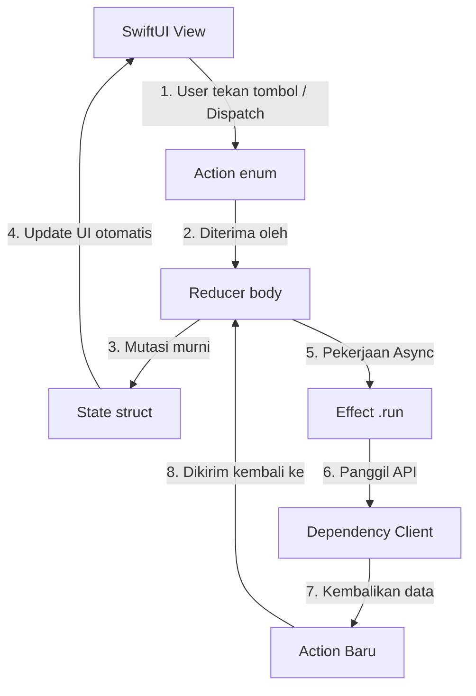
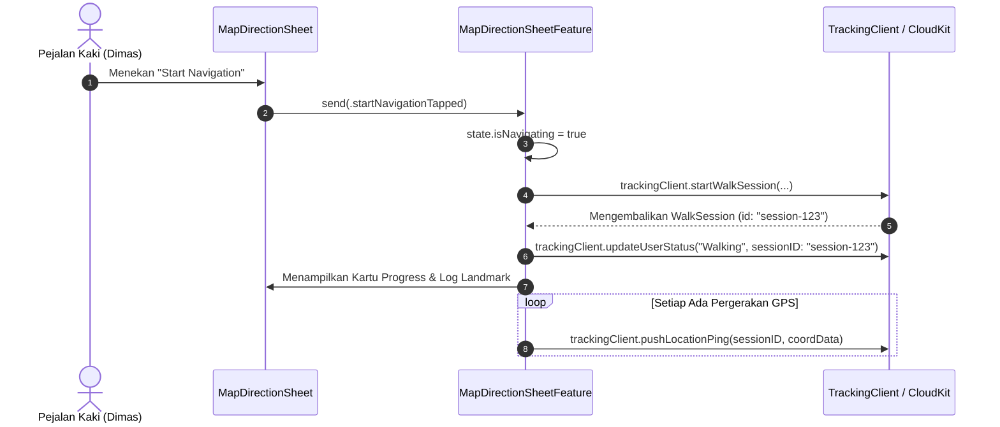
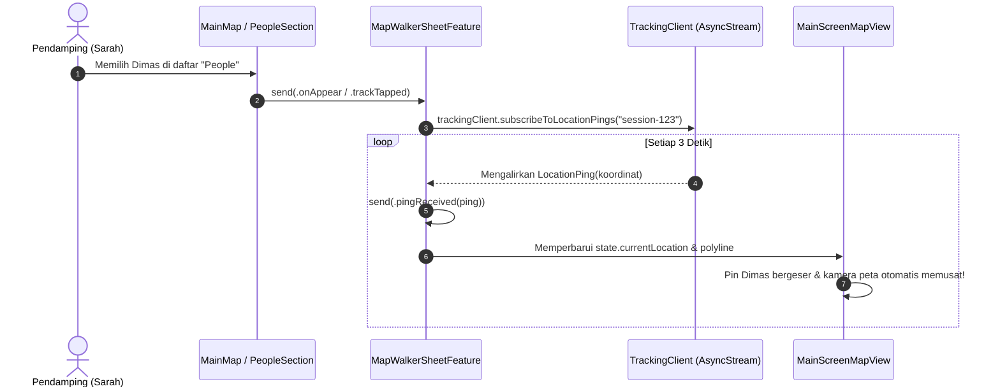

# 🚀 Panduan Arsitektur TCA & TrackingClient
*Manual Onboarding & Penjelasan Arsitektur untuk Engineer Astar (Bahasa Indonesia)*

---

## 📖 Daftar Isi
1. [Gambaran Umum: Apa yang Kita Bangun?](#1-gambaran-umum-apa-yang-kita-bangun)
2. [Analogi Utama: Menara Pengawas Lalu Lintas Udara (Air Traffic Control)](#2-analogi-utama-menara-pengawas-lalu-lintas-udara-air-traffic-control)
3. [Konsep Dasar TCA & Aliran Data Satu Arah (Unidirectional Data Flow)](#3-konsep-dasar-tca--aliran-data-satu-arah-unidirectional-data-flow)
4. [Pohon Arsitektur Fitur Astar](#4-pohon-arsitektur-fitur-astar)
5. [Bedah Kode: TrackingClient.swift & Apple CloudKit](#5-bedah-kode-trackingclientswift--apple-cloudkit)
6. [Alur End-to-End: Pejalan Kaki (Walker) vs. Pendamping (Companion)](#6-alur-end-to-end-pejalan-kaki-walker-vs-pendamping-companion)
7. [Kenapa Testing di TCA Sangat Cepat & Mudah (TestStore)](#7-kenapa-testing-di-tca-sangat-cepat--mudah-teststore)
8. [Lembar Rangkuman Singkat (Cheat Sheet) untuk Rekan Baru](#8-lembar-rangkuman-singkat-cheat-sheet-untuk-rekan-baru)

---

## 1. Gambaran Umum: Apa yang Kita Bangun?

**Astar** adalah aplikasi pendamping keamanan pejalan kaki berbasis *peer-to-peer*.
Aplikasi ini memungkinkan pengguna untuk:
1. **Berjalan dengan aman ke tujuan** dengan panduan rute *turn-by-turn* dan deteksi *landmark* (pos titik pemeriksaan).
2. **Membagikan perjalanan langsung secara real-time** ke teman terpercaya melalui Apple CloudKit.
3. **Mendampingi teman secara jarak jauh (Accompany)**: Teman dapat melihat lokasi langsung pejalan kaki, jarak yang telah ditempuh, *timeline landmark*, dan estimasi waktu sampai (ETA) tanpa perlu terus-menerus bertanya *"Lagi di mana?"*.

Untuk mengelola status data yang kompleks dan *asynchronous* (aliran GPS, *polling* CloudKit, transisi *sheet*, pergerakan kamera peta) tanpa *bug*, *race condition*, atau ketidaksinkronan data, Astar dibangun menggunakan **The Composable Architecture (TCA)** dari Point-Free.

---

## 2. Analogi Utama: Menara Pengawas Lalu Lintas Udara (ATC) ✈️📡

Jika kamu terbiasa dengan arsitektur iOS tradisional seperti MVVM biasa atau `@StateObject`, bayangkan TCA seperti **Pusat Komando Menara Pengawas Bandara (Air Traffic Control)**:

```
 ┌────────────────────────────────────────────────────────┐
 │           RUANG KONTROL PENGAWAS BANDARA (ATC)         │
 │                                                        │
 │   ┌─────────────────┐           ┌──────────────────┐   │
 │   │   LAYAR RADAR   │           │ PETUGAS KONTROL  │   │
 │   │     (STATE)     │           │    (REDUCER)     │   │
 │   └────────┬────────┘           └────────▲─────────┘   │
 │            │                             │             │
 │            ▼                             │             │
 │   ┌─────────────────┐           ┌────────┴─────────┐   │
 │   │ TAMPILAN KOKPIT │           │  PESAN RADIO     │   │
 │   │     (VIEW)      │──────────►│     (ACTION)     │   │
 │   └─────────────────┘ Tombol    └──────────────────┘   │
 │                       Ditekan                          │
 └──────────────────────────────────────────┬─────────────┘
                                            │ Memerintahkan Misi
                                            ▼
                                   ┌──────────────────┐
                                   │ KOMUNIKASI SATELIT│
                                   │ (EFFECT / .run)  │
                                   └────────┬─────────┘
                                            │ Memanggil
                                            ▼
                                   ┌──────────────────┐
                                   │ PERANGKAT RADIO  │
                                   │  (DEPENDENCY)    │
                                   │  TrackingClient  │
                                   └──────────────────┘
```

1. **State = Layar Radar Utama & Papan Status**
   - Ini adalah **sumber kebenaran tunggal (*single source of truth*)**. Layar ini mencatat semua data yang sedang aktif: posisi pesawat, landasan mana yang terbuka, dan siapa yang sedang terbang.
   - Dalam kode: Berupa Swift `struct State: Equatable`.

2. **Action = Pesan Radio & Kejadian Masuk**
   - Tidak ada data di radar yang berubah secara gaib. Perubahan hanya terjadi saat ada transmisi radio masuk (misal: `"Pesawat A meminta izin mendarat"`, `"Menerima sinyal GPS baru"`, `"Tombol batalkan navigasi ditekan"`).
   - Dalam kode: Berupa Swift `enum Action: Equatable`.

3. **Reducer = Petugas Pengawas (*Pure Decision Logic*)**
   - Petugas mendengar transmisi radio (**Action**), melihat radar saat ini (**State**), memperbarui catatan di papan status (**Mengubah/Mutasi State**), dan memutuskan apakah perlu menjalankan misi ke sistem luar (**Menjalankan Effect**).
   - Petugas tidak memiliki *side-effects* sembarangan; logikanya murni, terstruktur, dan mudah diprediksi.

4. **Effect (`.run`) = Misi Latar Belakang ke Satelit Luar**
   - Ketika petugas perlu mengambil data dari satelit, meminta cuaca dari server, atau melakukan *polling* ke CloudKit, mereka meluncurkan tugas latar belakang (`.run`). Saat tugas selesai, hasilnya dikirim kembali sebagai **Action baru**.

5. **Dependency (`@DependencyClient`) = Antarmuka Perangkat Radio**
   - Saat melatih petugas baru di simulator penerbangan, kita tidak menghubungkan mereka ke pesawat penumpang asli di langit; kita menghubungkannya ke **Radio Simulasi (Mock/Test)**.
   - `@DependencyClient` memungkinkan kita menukar koneksi internet CloudKit asli dengan data uji coba palsu saat *unit test* secara instan.

---

## 3. Konsep Dasar TCA & Aliran Data Satu Arah

Di TCA, data **selalu mengalir dalam satu lingkaran tertutup**:



### Mengapa Memilih TCA Dibanding MVVM Biasa?
- **Bebas *Race Condition***: Perubahan state hanya bisa terjadi di satu tempat (Reducer). Tidak ada dua *thread* yang saling berebut menimpa variabel.
- **Transparansi Penuh**: Setiap kali tombol ditekan atau data datang dari internet, ada `Action` bernama jelas yang tercatat. Debugging semudah membaca daftar riwayat aksi.
- **Mudah Diuji (*100% Testable*)**: Kita bisa menguji alur aplikasi lengkap (mulai dari pencarian Cibubur $\rightarrow$ mulai jalan $\rightarrow$ sampai tujuan) dalam hitungan milidetik tanpa koneksi internet sungguhan menggunakan `TestStore`.

---

## 4. Pohon Arsitektur Fitur Astar

Astar membagi aplikasinya menjadi modul-modul fitur yang independen dan tersusun rapi:

```
[MainFeature] (Root: Login Apple, Profil Pengguna, State Global)
   │
   ├── [LoginFeature] (Sign in with Apple, Pembuatan Akun CloudKit)
   ├── [ProfileFeature] (Tempat Tersimpan, Toggle Mode Developer, Pengaturan)
   │      └── [SavedPlacesFeature] (Alur Rumah, Kantor, dan Pin Kustom)
   │
   └── [MainMapFeature] (Tampilan MapKit, Kamera, Navigasi Aktif)
          │
          ├── [MapSearchSheetFeature] (Pencarian Lokasi & Resolusi POI)
          ├── [MapDirectionSheetFeature] (Kalkulasi Rute, Navigasi Walker, Log Perjalanan)
          └── [MapWalkerSheetFeature] (Live Tracking Teman, Polling Stream, Pendampingan)
```

Setiap fitur anak memiliki `State`, `Action`, dan `Reducer`-nya sendiri, lalu dihubungkan ke fitur induk menggunakan operator `Scope` atau `ifLet`.

---

## 5. Bedah Kode: `TrackingClient.swift` & Apple CloudKit

[`TrackingClient.swift`](file:///Users/dimasps32/Developer/apple-dev/challenge-apple-dev/challenge-5/Astar/Astar/Shared/CloudKit/TrackingClient.swift) adalah penghubung antara fitur TCA Astar dan database **Apple CloudKit** (`CKContainer.default().publicCloudDatabase`).

### 📦 3 Model Data Utama CloudKit

```swift
// 1. Sesi Perjalanan yang Sedang Berlangsung
struct WalkSession: Equatable, Sendable {
    let id: String                  // Nama Record CloudKit
    let walkerRef: String           // User ID CloudKit orang yang sedang berjalan
    var status: String              // "active" atau "completed"
    let destinationName: String     // Contoh: "Home", "Kopi Kenangan Cibubur"
    let destinationLatitude: Double
    let destinationLongitude: Double
    let routePolyline: String?      // String polyline rute MapKit terenkripsi
    let startedAt: Date
    let endedAt: Date?
    let lastPingAt: Date
}

// 2. Data Teman yang Bergabung Mendampingi
struct SessionParticipant: Equatable, Sendable {
    let id: String
    let sessionRef: String          // ID dari WalkSession yang diikuti
    let companionRef: String        // User ID teman yang mendampingi
    let joinedAt: Date
}

// 3. Titik Sinyal GPS Real-Time (Breadcrumb)
struct LocationPing: Equatable, Sendable {
    let id: String
    let sessionRef: String
    let encodedCoordinates: [Data]  // Data byte koordinat GPS
    let recordedAt: Date
}
```

---

### 🛠 Fungsi-Fungsi dalam `TrackingClient`

Dideklarasikan menggunakan makro `@DependencyClient`:

```swift
@DependencyClient
struct TrackingClient: Sendable {
    // Operasi Pejalan Kaki (Walker)
    var startWalkSession: @Sendable (_ walkerRecordID: String, _ destinationName: String, _ destLat: Double, _ destLon: Double, _ routePolyline: String?) async throws -> WalkSession
    var endWalkSession: @Sendable (_ sessionID: String) async throws -> Void
    var pushLocationPing: @Sendable (_ sessionID: String, _ coordinatesData: Data) async throws -> Void
    var updateUserStatus: @Sendable (_ userRecordID: String, _ status: String, _ activeSessionID: String?, _ watchingSessionID: String?) async throws -> Void

    // Operasi Pendamping (Companion)
    var getWalkSession: @Sendable (_ sessionID: String) async throws -> WalkSession
    var getWalkerActiveSessionID: @Sendable (_ walkerRecordID: String) async throws -> String?
    var joinWalkSession: @Sendable (_ sessionID: String, _ companionRecordID: String) async throws -> SessionParticipant
    var leaveWalkSession: @Sendable (_ participantID: String) async throws -> Void

    // Aliran GPS Langsung (Streaming)
    var subscribeToLocationPings: @Sendable (_ sessionID: String) async throws -> AsyncStream<LocationPing>
}
```

---

### 📡 Cara Kerja Streaming Lokasi Langsung (`AsyncStream`)

Alih-alih menggunakan WebSocket yang berat, `TrackingClient` menggunakan mekanisme **`AsyncStream` polling loop** (mengambil data setiap 3 detik) pada fungsi `subscribeToLocationPings`:

```swift
subscribeToLocationPings: { sessionID in
    AsyncStream { continuation in
        let task = Task {
            while !Task.isCancelled {
                // 1. Minta record LocationPing terbaru dari CloudKit yang sesuai sessionID
                let query = CKQuery(recordType: "LocationPing", predicate: NSPredicate(value: true))
                if let latestPingRecord = try? await fetchLatestPing(matching: sessionID) {
                    // 2. Teruskan titik lokasi ke TCA Reducer
                    continuation.yield(latestPingRecord)
                }
                // 3. Tunggu 3 detik sebelum polling berikutnya
                try? await Task.sleep(nanoseconds: 3_000_000_000)
            }
        }

        // 4. Otomatis berhenti saat pendamping menutup sheet atau keluar
        continuation.onTermination = { _ in
            task.cancel()
        }
    }
}
```

---

## 6. Alur End-to-End: Pejalan Kaki vs. Pendamping

Mari kita ikuti bagaimana perjalanan bekerja di aplikasi Astar!

### Skenario A: Dimas Mulai Berjalan (Walker)



1. Dimas menekan tombol **"Start Navigation"** pada [`DirectionCard.swift`](file:///Users/dimasps32/Developer/apple-dev/challenge-apple-dev/challenge-5/Astar/Astar/Features/Map/Components/Direction/DirectionCard.swift).
2. Tampilan mengirim `MapDirectionSheetFeature.Action.startNavigationTapped`.
3. Reducer:
   - Mengubah `state.isNavigating = true` dan `state.mode = .progress`.
   - Menjalankan `.run` effect untuk memanggil `trackingClient.startWalkSession(...)`.
   - Memperbarui status profil Dimas di CloudKit menjadi `"Walking"`.
4. Selama Dimas berjalan, pembaruan GPS memanggil `trackingClient.pushLocationPing(...)` untuk mengirim koordinat ke CloudKit.

---

### Skenario B: Sarah Mendampingi Dimas (Companion)



1. Sarah membuka Astar dan melihat **Dimas** berstatus `"Walking"` di bagian **People**.
2. Sarah mengetuk profil Dimas. `MainMapFeature` membuka [`MapWalkerSheetFeature`](file:///Users/dimasps32/Developer/apple-dev/challenge-apple-dev/challenge-5/Astar/Astar/Features/Map/MapWalkerSheetFeature.swift).
3. Reducer memanggil `trackingClient.subscribeToLocationPings(sessionID)`.
4. Di latar belakang, loop `AsyncStream` mengambil data dari CloudKit setiap 3 detik.
5. Setiap sinyal baru mengirim `Action.pingReceived(ping)` ke Reducer.
6. Reducer mengekstrak koordinat GPS dan memperbarui `state.currentLocation`.
7. [`MainScreenMapView.swift`](file:///Users/dimasps32/Developer/apple-dev/challenge-apple-dev/challenge-5/Astar/Astar/Features/Map/View/MainScreenMapView.swift) mendeteksi pembaruan dan menggeser marker avatar Dimas di peta secara halus dan *real-time*!

---

## 7. Kenapa Testing di TCA Sangat Cepat & Mudah (`TestStore`)

Pada arsitektur biasa, menguji integrasi jaringan CloudKit dan *streaming* GPS memerlukan server tiruan yang lambat dan rentan *timeout*.

Di TCA, pengujian bersifat **100% deterministik dan instan**. Berikut contoh pengujian fungsi navigasi dari [`MapDirectionSheetFeatureTests.swift`](file:///Users/dimasps32/Developer/apple-dev/challenge-apple-dev/challenge-5/Astar/AstarTests/MapDirectionSheetFeatureTests.swift):

```swift
@Test
@MainActor
func testStartNavigationTapped() async {
  let dest = SavedPlace(name: "Home", subtitle: "Cibubur", iconName: "house.fill", coordinate: CLLocationCoordinate2D(latitude: -6.37, longitude: 106.90))
  let coord = CLLocationCoordinate2D(latitude: -6.20, longitude: 106.84)
  
  let store = TestStore(initialState: MapDirectionSheetFeature.State(destination: dest)) {
    MapDirectionSheetFeature()
  } withDependencies: {
    $0.uuid = .incrementing
    // Pasang tiruan (mock) dependency CloudKit:
    $0.trackingClient.startWalkSession = { _, _, _, _, _ in
      WalkSession(
        id: "session-1",
        walkerRef: "user-dimas",
        status: "active",
        destinationName: "Home",
        destinationLatitude: -6.37,
        destinationLongitude: 106.90,
        routePolyline: nil,
        startedAt: Date(timeIntervalSince1970: 0),
        endedAt: nil,
        lastPingAt: Date(timeIntervalSince1970: 0)
      )
    }
    $0.trackingClient.updateUserStatus = { _, _, _, _ in }
  }

  // Eksekusi dan pastikan perubahan state akurat langkah demi langkah
  await store.send(.startNavigationTapped(currentLocation: coord)) {
    $0.isNavigating = true
    $0.isDestinationReached = false
    $0.mode = .progress
  }
}
```

Pengujian ini selesai dalam waktu **0,01 detik** tanpa memerlukan koneksi internet sama sekali!

---

## 8. Lembar Rangkuman Singkat (Cheat Sheet) 📋

| Istilah | Penjelasan Sederhana | Contoh Lokasi di Kode |
| :--- | :--- | :--- |
| **`State`** | *Struct* penyimpan seluruh data tampilan & status bisnis. | `MapDirectionSheetFeature.State` di [`MapDirectionSheetFeature.swift`](file:///Users/dimasps32/Developer/apple-dev/challenge-apple-dev/challenge-5/Astar/Astar/Features/Map/MapDirectionSheetFeature.swift#L10) |
| **`Action`** | *Enum* yang mendata semua peristiwa yang bisa terjadi di layar. | `MapDirectionSheetFeature.Action` di [`MapDirectionSheetFeature.swift`](file:///Users/dimasps32/Developer/apple-dev/challenge-apple-dev/challenge-5/Astar/Astar/Features/Map/MapDirectionSheetFeature.swift#L30) |
| **`Reducer`** | Mesin logika murni: `(inout State, Action) -> Effect<Action>`. | `var body: some Reducer<State, Action>` |
| **`Effect (.run)`** | Blok *side-effect async* untuk memanggil API luar & mengirim aksi balasan. | `.run { send in ... }` |
| **`@DependencyClient`** | Antarmuka layanan eksternal (CloudKit, GPS, Pencarian Tempat). | [`TrackingClient.swift`](file:///Users/dimasps32/Developer/apple-dev/challenge-apple-dev/challenge-5/Astar/Astar/Shared/CloudKit/TrackingClient.swift#L33) |
| **`TestStore`** | Alat pengujian TCA untuk memverifikasi logika dan mutasi data secara presisi. | [`MapDirectionSheetFeatureTests.swift`](file:///Users/dimasps32/Developer/apple-dev/challenge-apple-dev/challenge-5/Astar/AstarTests/MapDirectionSheetFeatureTests.swift) |
| **`WithPerceptionTracking`** | Pembungkus optimasi *rendering* SwiftUI agar cepat dan hemat daya. | Di seluruh View SwiftUI |

---
*Selamat datang di tim pengembang Astar! Silakan gunakan panduan ini kapan saja saat merancang fitur baru atau menulis unit test.*
