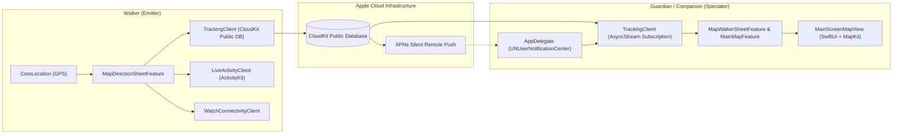

# Trail (Astar) 🧭🚶‍♂️

> **Real-time Walking Safety & Companion Tracking Application for iOS & watchOS**  
> Built with **The Composable Architecture (TCA)**, **SwiftUI**, **MapKit**, **CloudKit**, and **ActivityKit**.

---

## 📖 Overview

**Trail** (internal project codename: *Astar*) is an iOS and watchOS application designed to ensure pedestrian safety and peace of mind during daily commutes and urban walks. 

When users embark on journeys on foot, Trail enables them to share their live walking telemetry with designated trusted companions (*Guardians*). Companions can observe live position updates, milestone checkpoints (*Journey Log*), and estimated arrival times in real time through interactive MapKit overlays, Dynamic Island Heads-Up Displays (HUD), Lock Screen Live Activities, and Apple Watch widgets.

The project is built on **The Composable Architecture (TCA)** by Point-Free, enforcing unidirectional data flow, modular feature isolation, comprehensive side-effect encapsulation, and deterministic state transitions.



---

## 🎯 Technical Objectives & Architectural Matrix

The following matrix details the core features of Trail, the underlying Apple and third-party frameworks, technical descriptions with key APIs, and their concrete application within the project:

| Feature Area | Framework(s) | Technical Description & Key APIs | Application in Trail |
| :--- | :--- | :--- | :--- |
| **State Machine & App Architecture** | **The Composable Architecture (TCA)** (`ComposableArchitecture`) | Unidirectional Data Flow architecture based on Redux and Finite State Machines (FSM).<br>• `@Reducer`<br>• `@ObservableState`<br>• `StackState` / `StackAction`<br>• `@Presents` / `@DependencyClient` | Manages root navigation ([`MainFeature.swift`](file:///Users/nad/Developer/XCode/Astar/Astar/Features/Main/MainFeature.swift)), map states ([`MainMapFeature.swift`](file:///Users/nad/Developer/XCode/Astar/Astar/Features/Map/MainMapFeature.swift)), modal sheets ([`MapSheetFeature.swift`](file:///Users/nad/Developer/XCode/Astar/Astar/Features/Map/MapSheetFeature.swift)), and child reducers without mutable state aliasing or data races. |
| **Distributed Telemetry & Remote Push** | **CloudKit** (`CloudKit`), **UserNotifications** (`UserNotifications`) | Distributed multi-tenant NoSQL and graph storage backed by APNs query subscriptions for real-time reactive sync.<br>• `CKContainer.publicCloudDatabase`<br>• `CKQuerySubscription`<br>• `CKModifyRecordsOperation`<br>• `UNUserNotificationCenter` | [`TrackingClient.swift`](file:///Users/nad/Developer/XCode/Astar/Astar/Shared/CloudKit/TrackingClient.swift) persists walk sessions and updates location pings using `.changedKeys` policy. Broadcasts silent APNs pushes to companions so their map markers update automatically without heavy battery-draining polling. |
| **Social Graph & Mutual Connections** | **CloudKit** (`CloudKit`) | Graph database pattern representing bidirectional social edges (`member1`, `member2`, `status`).<br>• `CKRecord`<br>• `CKRecord.Reference`<br>• `NSPredicate` disjunctive queries | [`ConnectionsClient.swift`](file:///Users/nad/Developer/XCode/Astar/Astar/Shared/CloudKit/ConnectionsClient.swift) queries mutual trusted connections (`mutual`, `request`, `rejected`) and executes two-phase handshakes when adding guardians. |
| **Location Hardware & Geodesy** | **CoreLocation** (`CoreLocation`) | Hardware Abstraction Layer (HAL) wrapping continuous GPS streams and background location updates.<br>• `CLLocationManager`<br>• `CLLocationManagerDelegate`<br>• `AsyncStream`<br>• `kCLLocationAccuracyBest` | [`LocationManagerClient.swift`](file:///Users/nad/Developer/XCode/Astar/Astar/Features/Map/Clients/LocationManagerClient.swift) provides an actor-isolated stream (`@MainActor LocationManagerActor`) converting delegate callbacks into Swift Concurrency streams with background execution support. |
| **Turn-by-Turn Routing & Geocoding** | **MapKit** (`MapKit`) | Geospatial pathfinding, spatial bounding queries, and polyline route decoders.<br>• `MKDirections`<br>• `MKLocalSearch`<br>• `MKRoute`<br>• `MKPolyline` | [`DirectionRouteClient.swift`](file:///Users/nad/Developer/XCode/Astar/Astar/Features/Map/Clients/DirectionRouteClient.swift) computes walking routes, ETA, and distances. [`PlaceSearchClient.swift`](file:///Users/nad/Developer/XCode/Astar/Astar/Features/Map/Clients/PlaceSearchClient.swift) runs fuzzy multi-source location search with $O(1)$ set deduplication. |
| **Dynamic Island & Glanceable UI** | **ActivityKit** (`ActivityKit`), **WidgetKit** (`WidgetKit`) | Dynamic Island and Lock Screen Live Activities hosted in a separate sandboxed `WidgetExtension` process.<br>• `Activity<TrailWalkAttributes>`<br>• `ActivityConfiguration`<br>• `DynamicIslandExpandedRegion` | [`TrailLiveActivityWidget.swift`](file:///Users/nad/Developer/XCode/Astar/Astar/Shared/ActivityKit/TrailLiveActivityWidget.swift) and [`LiveActivityClient.swift`](file:///Users/nad/Developer/XCode/Astar/Astar/Shared/ActivityKit/LiveActivityClient.swift) project walker progress, milestones, and ETA onto the user's Dynamic Island (compact, minimal, expanded) and Lock Screen. |
| **Wearable Integration** | **WatchConnectivity** (`WatchConnectivity`) | Low-latency Bluetooth/Wi-Fi IPC channel bridging the iOS host app with watchOS companion devices.<br>• `WCSession`<br>• `WCSessionDelegate`<br>• `transferCurrentComplicationUserInfo` | [`WatchConnectivityClient.swift`](file:///Users/nad/Developer/XCode/Astar/Astar/Shared/WatchConnectivity/WatchConnectivityClient.swift) streams trip updates (direction states, destination title, distance) directly to the Apple Watch. |
| **Siri & Shortcuts Integration** | **AppIntents** (`AppIntents`) | Out-of-process OS-level action exposure indexed by Spotlight and triggered via Siri voice commands.<br>• `AppIntent`<br>• `AppShortcutsProvider`<br>• `perform() async throws` | [`NavigateOfficeIntent.swift`](file:///Users/nad/Developer/XCode/Astar/Astar/Features/Intents/NavigateOfficeIntent.swift), [`NavigateAgoraMallIntent.swift`](file:///Users/nad/Developer/XCode/Astar/Astar/Features/Intents/NavigateAgoraMallIntent.swift), and [`AlwaysHomeIntent.swift`](file:///Users/nad/Developer/XCode/Astar/Astar/Features/Intents/AlwaysHomeIntent.swift) launch instant navigation shortcuts via deep-link scheme `astar://navigate?...`. |
| **Contact Resolution & Avatars** | **Contacts** (`Contacts`) | On-device SQLite address book query engine with multi-stage fuzzy string matching.<br>• `CNContactStore`<br>• `CNContactFetchRequest`<br>• Exact & Tokenized N-Gram Match | [`ContactPhotoClient.swift`](file:///Users/nad/Developer/XCode/Astar/Astar/Shared/Contacts/ContactPhotoClient.swift) matches CloudKit emails and names to on-device contacts to display high-resolution profile avatars for trusted companions. |

---

## 🏗️ System Requirements & Environment

### Development Environment
* **macOS**: macOS 14.0 (Sonoma) or newer (macOS 15.0+ Sequoia recommended).
* **Xcode**: Xcode 16.0 or newer (Swift 5.10 / Swift 6 toolchain).
* **Package Manager**: Swift Package Manager (SPM) integrated directly in Xcode.

### Runtime Target Requirements
* **iOS**: iOS 17.0+ (iOS 18.0+ for full interactive widget and Dynamic Island capabilities).
* **watchOS**: watchOS 10.0+ (for watch companion target).
* **Device Capabilities**:
  * Physical iPhone with GPS and cellular connectivity recommended for full APNs and live location testing (Simulators cannot receive APNs remote pushes without mocked payloads).
  * Dynamic Island supported on iPhone 14 Pro, iPhone 15 series, and iPhone 16 series.

### Dependencies (via SPM)
* **[swift-composable-architecture](https://github.com/pointfreeco/swift-composable-architecture)**: Version 1.10.0+
* **[swift-dependencies](https://github.com/pointfreeco/swift-dependencies)**: Dependency injection subsystem.

---

## 🔒 Permissions & Privacy

Trail relies on specific hardware sensors and privacy-sensitive operating system capabilities. The application adheres to Apple's Human Interface Guidelines by providing clear, context-specific justifications when requesting authorization:

| Permission / Key | Info.plist / Capability Key | Justification & Purpose |
| :--- | :--- | :--- |
| **Location (When In Use & Always)** | `NSLocationWhenInUseUsageDescription`<br>`NSLocationAlwaysAndWhenInUseUsageDescription` | Required to display the user's current position on the map, calculate pedestrian routes to destinations, geofence milestones, and stream telemetry to trusted companions. |
| **Background Location** | `UIBackgroundModes` -> `location` | Enables continuous location tracking while the user walks with the phone locked in their pocket, ensuring companions receive timely safety updates. |
| **Remote Push Notifications** | `UIBackgroundModes` -> `remote-notification`<br>`UNUserNotificationCenter` | Essential for receiving silent background CloudKit push notifications that wake the companion app when a walker sends an invite, reaches a milestone, or broadcasts position updates. |
| **Contacts** | `NSContactsUsageDescription` | Used locally on-device to match companion email addresses and names against the user's address book to display friendly names and contact photos. Contact data is never uploaded or shared externally. |
| **Live Activities** | `NSSupportsLiveActivities`<br>`NSSupportsLiveActivitiesFrequentUpdates` | Enables real-time rendering of walk progress on the Lock Screen and Dynamic Island with high-frequency updates during active sessions. |
| **CloudKit & iCloud** | `com.apple.developer.icloud-services` (`CloudKit`) | Authenticates users seamlessly via Apple ID and manages multi-user session data in the public and private CloudKit containers without requiring third-party credentials. |

---

## 📂 Project Structure

```
Astar/
├── App/
│   ├── AppDelegate/         # APNs message dispatcher & notification category hooks
│   ├── AstarApp.swift       # App entry point & TCA store initialization
│   ├── ContentView.swift    # Root perception container
│   └── RootFeature.swift    # Top-level FSM routing between Onboarding and Main
├── Features/
│   ├── Guardian/            # Companion spectator UI (cards, history, live status)
│   ├── Intents/             # App Intents & Siri Shortcuts (Home, Office, Agora Mall)
│   ├── Login/               # Sign in with Apple & profile creation
│   ├── Main/                # Central navigation coordinator & pushdown stack
│   ├── Map/                 # MapKit engine, search, route generation, bottom sheet
│   ├── Navigation/          # Deep link URL parser & router
│   ├── Onboarding/          # First-time permissions & onboarding carousel
│   └── Profile/             # User settings, saved places, and trusted contact directory
└── Shared/
    ├── ActivityKit/         # Live Activity widget & dynamic island attributes
    ├── CloudKit/            # Telemetry sync (TrackingClient) & social graph (ConnectionsClient)
    ├── Contacts/            # Address book fuzzy avatar resolution client
    └── WatchConnectivity/   # Apple Watch session bridge and message models
```

---

## 🚀 Getting Started

1. **Clone the repository**:
   ```bash
   git clone https://github.com/mproyyan/Astar.git
   cd Astar
   ```
2. **Open in Xcode**:
   ```bash
   open Astar.xcodeproj
   ```
3. **Configure Signing & iCloud Capabilities**:
   * Navigate to the **Astar** target in Xcode under **Signing & Capabilities**.
   * Select your Apple Developer Team.
   * Verify that **iCloud** (CloudKit container: `iCloud.com.astar.trail`), **Push Notifications**, and **Background Modes** are enabled.
4. **Run on Physical Device**:
   * Select an iPhone connected via USB/Wi-Fi as the active run destination.
   * Build and run (`Cmd + R`).
