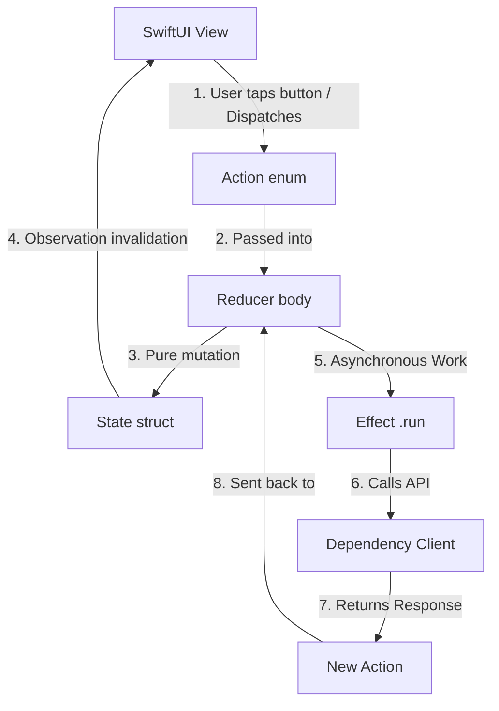
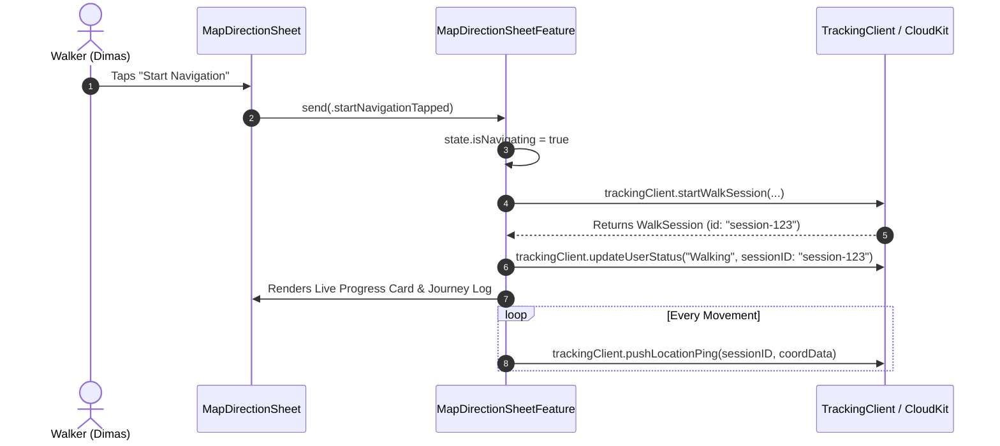
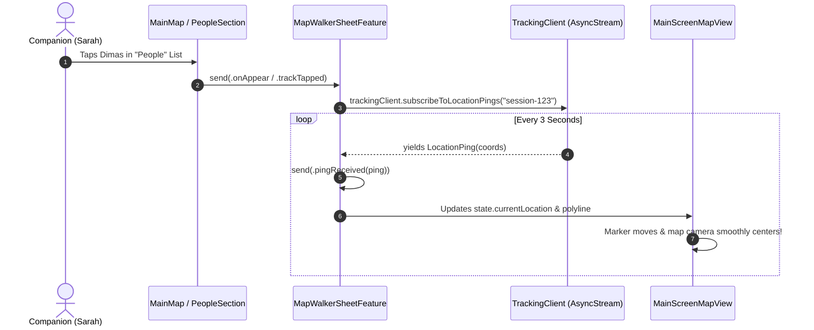

# 🚀 The Composable Architecture (TCA) & TrackingClient Guide
*An Onboarding Manual & Architectural Walkthrough for Astar Engineers*

---

## 📖 Table of Contents
1. [The Big Picture: What Are We Building?](#1-the-big-picture-what-are-we-building)
2. [The Core Analogy: The Air Traffic Control Center](#2-the-core-analogy-the-air-traffic-control-center)
3. [TCA Fundamentals & The Unidirectional Data Flow](#3-tca-fundamentals--the-unidirectional-data-flow)
4. [Astar Feature Architecture Tree](#4-astar-feature-architecture-tree)
5. [Deep Dive: TrackingClient.swift & Apple CloudKit](#5-deep-dive-trackingclientswift--apple-cloudkit)
6. [End-to-End Walkthrough: Walker vs. Companion](#6-end-to-end-walkthrough-walker-vs-companion)
7. [Why TCA Testing is Supercharged (TestStore)](#7-why-tca-testing-is-supercharged-teststore)
8. [Summary Cheat Sheet for New Recruits](#8-summary-cheat-sheet-for-new-recruits)

---

## 1. The Big Picture: What Are We Building?

**Astar** is a peer-to-peer pedestrian safety and accompaniment app. 
It allows users to:
1. **Walk safely to a destination** with turn-by-turn route guides and dynamic landmark checkpoints.
2. **Share live walk sessions in real-time** with trusted companions over Apple CloudKit.
3. **Accompany friends remotely**: Companions can view the walker’s live location, distance traveled, landmark timeline, and ETA without having to constantly text *"Where are you?"*.

To manage complex asynchronous states (GPS streams, CloudKit polling, sheet transitions, map camera movements) without bugs, race conditions, or state desynchronization, Astar is built on **The Composable Architecture (TCA)** by Point-Free.

---

## 2. The Core Analogy: The Air Traffic Control Center ✈️📡

If you are coming from traditional iOS architectures like standard MVVM or `@StateObject`, think of TCA as an **Airport Air Traffic Control (ATC) Center**:

```
 ┌────────────────────────────────────────────────────────┐
 │            AIR TRAFFIC CONTROL COMMAND ROOM            │
 │                                                        │
 │   ┌─────────────────┐           ┌──────────────────┐   │
 │   │  RADAR SCREEN   │           │    CONTROLLER    │   │
 │   │     (STATE)     │           │    (REDUCER)     │   │
 │   └────────┬────────┘           └────────▲─────────┘   │
 │            │                             │             │
 │            ▼                             │             │
 │   ┌─────────────────┐           ┌────────┴─────────┐   │
 │   │ COCKPIT DISPLAY │           │  RADIO MESSAGE   │   │
 │   │     (VIEW)      │──────────►│     (ACTION)     │   │
 │   └─────────────────┘ Button    └──────────────────┘   │
 │                       Pressed                          │
 └──────────────────────────────────────────┬─────────────┘
                                            │ Spawns Mission
                                            ▼
                                   ┌──────────────────┐
                                   │ SATELLITE COMMS  │
                                   │  (EFFECT / .run) │
                                   └────────┬─────────┘
                                            │ Calls
                                            ▼
                                   ┌──────────────────┐
                                   │ RADIO HARDWARE   │
                                   │  (DEPENDENCY)    │
                                   │  TrackingClient  │
                                   └──────────────────┘
```

1. **State = The Master Radar Screen & Status Board**
   - It is the **single source of truth**. It lists every piece of data currently active: where planes are, which runway is open, who is flying.
   - In code: A Swift `struct State: Equatable`.

2. **Action = Radio Transmissions & Events**
   - Nothing on the radar changes magically. A change only happens when a radio transmission is received (e.g. `"Flight 101 requests landing"`, `"GPS ping received"`, `"Cancel button tapped"`).
   - In code: A Swift `enum Action: Equatable`.

3. **Reducer = The Air Traffic Controller (Pure Decision Logic)**
   - The human controller hears the radio transmission (**Action**), looks at the current radar (**State**), updates the status board (**Mutates State**), and decides if they need to dispatch orders to external systems (**Spawns Effects**).
   - The controller has **zero side effects on their own**; they are deterministic and predictable.

4. **Effect (`.run`) = Outgoing Background Missions**
   - When the controller needs to talk to external satellites, fetch weather from a server, or poll CloudKit, they start a background task (`.run`). When that background task finishes, it radios back a **new Action**.

5. **Dependency (`@DependencyClient`) = The Radio Equipment Interface**
   - When training a rookie controller in a flight simulator, you don't connect them to real passenger jets in the sky; you plug them into a **Mock/Test Radio**.
   - `@DependencyClient` lets us swap real CloudKit network calls with mock test responses in our unit tests instantly.

---

## 3. TCA Fundamentals & The Unidirectional Data Flow

In TCA, data **always flows in a strict, one-way circle**:



### Why do we use TCA over standard MVVM?
- **No Race Conditions**: State changes can only happen in one place (the Reducer). Two threads cannot modify state in conflicting ways.
- **Total Visibility**: Every user interaction, network response, or timer tick is an explicit `Action`. Debugging is as simple as reading the list of printed actions in the console.
- **100% Testable**: You can write unit tests for complete asynchronous journeys (from login $\rightarrow$ searching Cibubur $\rightarrow$ walking $\rightarrow$ arriving) with zero flaky network delays using `TestStore`.

---

## 4. Astar Feature Architecture Tree

Astar organizes its codebase as a tree of modular, isolated features:

```
[MainFeature] (App Root: Login & Auth, User Profile, Global State)
   │
   ├── [LoginFeature] (Sign in with Apple, CloudKit User Setup)
   ├── [ProfileFeature] (Saved Places, Developer Mode Toggle, Settings)
   │      └── [SavedPlacesFeature] (Home, Office, Custom Pins flow)
   │
   └── [MainMapFeature] (MapKit Viewport, Camera, Active Navigation)
          │
          ├── [MapSearchSheetFeature] (Search Completer, POI Lookup)
          ├── [MapDirectionSheetFeature] (Route calculation, Walker Navigation, Journey Log)
          └── [MapWalkerSheetFeature] (Companion Live Tracking, Polling Stream, Accompany)
```

Each child feature has its own independent `State`, `Action`, and `Reducer`, and the parent embeds them using TCA's `Scope` or `ifLet` presentation operators.

---

## 5. Deep Dive: `TrackingClient.swift` & Apple CloudKit

[`TrackingClient.swift`](file:///Users/dimasps32/Developer/apple-dev/challenge-apple-dev/challenge-5/Astar/Astar/Shared/CloudKit/TrackingClient.swift) is the bridge between Astar's TCA features and **Apple CloudKit** (`CKContainer.default().publicCloudDatabase`).

### 📦 The 3 Core CloudKit Data Models

```swift
// 1. A Live Journey
struct WalkSession: Equatable, Sendable {
    let id: String                  // CloudKit Record Name
    let walkerRef: String           // CloudKit User ID of the person walking
    var status: String              // "active" or "completed"
    let destinationName: String     // e.g. "Home", "Kopi Kenangan Cibubur"
    let destinationLatitude: Double
    let destinationLongitude: Double
    let routePolyline: String?      // Encoded MapKit polyline string
    let startedAt: Date
    let endedAt: Date?
    let lastPingAt: Date
}

// 2. A Companion Joining the Journey
struct SessionParticipant: Equatable, Sendable {
    let id: String
    let sessionRef: String          // ID of the WalkSession
    let companionRef: String        // User ID of the watching friend
    let joinedAt: Date
}

// 3. A Real-Time GPS Breadcrumb
struct LocationPing: Equatable, Sendable {
    let id: String
    let sessionRef: String
    let encodedCoordinates: [Data]  // Serialized GPS byte coordinates
    let recordedAt: Date
}
```

---

### 🛠 The `TrackingClient` Interface

Declared with the `@DependencyClient` macro:

```swift
@DependencyClient
struct TrackingClient: Sendable {
    // Walker operations
    var startWalkSession: @Sendable (_ walkerRecordID: String, _ destinationName: String, _ destLat: Double, _ destLon: Double, _ routePolyline: String?) async throws -> WalkSession
    var endWalkSession: @Sendable (_ sessionID: String) async throws -> Void
    var pushLocationPing: @Sendable (_ sessionID: String, _ coordinatesData: Data) async throws -> Void
    var updateUserStatus: @Sendable (_ userRecordID: String, _ status: String, _ activeSessionID: String?, _ watchingSessionID: String?) async throws -> Void

    // Companion operations
    var getWalkSession: @Sendable (_ sessionID: String) async throws -> WalkSession
    var getWalkerActiveSessionID: @Sendable (_ walkerRecordID: String) async throws -> String?
    var joinWalkSession: @Sendable (_ sessionID: String, _ companionRecordID: String) async throws -> SessionParticipant
    var leaveWalkSession: @Sendable (_ participantID: String) async throws -> Void

    // Live GPS Stream
    var subscribeToLocationPings: @Sendable (_ sessionID: String) async throws -> AsyncStream<LocationPing>
}
```

---

### 📡 How Live Location Streaming Works (`AsyncStream`)

Instead of complex WebSockets or Push Notification overhead, `TrackingClient` uses a clean, resilient **`AsyncStream` polling loop** (polling every 3 seconds) in `subscribeToLocationPings`:

```swift
subscribeToLocationPings: { sessionID in
    AsyncStream { continuation in
        let task = Task {
            while !Task.isCancelled {
                // 1. Query CloudKit for latest LocationPing records matching sessionID
                let query = CKQuery(recordType: "LocationPing", predicate: NSPredicate(value: true))
                if let latestPingRecord = try? await fetchLatestPing(matching: sessionID) {
                    // 2. Yield to the TCA Reducer
                    continuation.yield(latestPingRecord)
                }
                // 3. Sleep 3 seconds before next poll
                try? await Task.sleep(nanoseconds: 3_000_000_000)
            }
        }

        // 4. Clean cancellation when companion leaves or closes the sheet
        continuation.onTermination = { _ in
            task.cancel()
        }
    }
}
```

---

## 6. End-to-End Walkthrough: Walker vs. Companion

Let’s trace the exact lifecycle of a walk session from both perspectives!

### Scenario A: Dimas Starts Walking (The Walker)



1. **User taps "Start Navigation"** on [`DirectionCard.swift`](file:///Users/dimasps32/Developer/apple-dev/challenge-apple-dev/challenge-5/Astar/Astar/Features/Map/Components/Direction/DirectionCard.swift).
2. The view sends `MapDirectionSheetFeature.Action.startNavigationTapped`.
3. The reducer:
   - Sets `state.isNavigating = true` and `state.mode = .progress`.
   - Spawns a `.run` effect calling `trackingClient.startWalkSession(...)`.
   - Calls `trackingClient.updateUserStatus(...)` with status `"Walking"`.
4. As Dimas walks, GPS updates invoke `trackingClient.pushLocationPing(...)` to push coordinates to CloudKit.

---

### Scenario B: Sarah Accompanies Dimas (The Companion)



1. Sarah opens Astar and sees **Dimas** with status `"Walking"` in the **People** section.
2. Sarah taps Dimas. `MainMapFeature` opens [`MapWalkerSheetFeature`](file:///Users/dimasps32/Developer/apple-dev/challenge-apple-dev/challenge-5/Astar/Astar/Features/Map/MapWalkerSheetFeature.swift).
3. The reducer calls `trackingClient.subscribeToLocationPings(sessionID)`.
4. In the background, the `AsyncStream` loop polls CloudKit and yields a `LocationPing` every 3 seconds.
5. Each ping dispatches `.pingReceived(ping)` into `MapWalkerSheetFeature`.
6. The reducer decodes the GPS coordinates and updates `state.currentLocation`.
7. [`MainScreenMapView.swift`](file:///Users/dimasps32/Developer/apple-dev/challenge-apple-dev/challenge-5/Astar/Astar/Features/Map/View/MainScreenMapView.swift) observes the change and smoothly translates Dimas’s orange avatar marker across the map in real time!

---

## 7. Why TCA Testing is Supercharged (`TestStore`)

In standard iOS code, testing CloudKit network calls and GPS streams requires spinning up mock servers, handling timeouts, and dealing with flaky tests.

With TCA, testing is **100% deterministic and instantaneous**. Here is how we test starting a navigation session from [`MapDirectionSheetFeatureTests.swift`](file:///Users/dimasps32/Developer/apple-dev/challenge-apple-dev/challenge-5/Astar/AstarTests/MapDirectionSheetFeatureTests.swift):

```swift
@Test
@MainActor
func testStartNavigationTapped() async {
  let dest = SavedPlace(name: "Home", subtitle: "Cibubur", iconName: "house.fill", coordinate: CLLocationCoordinate2D(latitude: -6.37, longitude: 106.90))
  let coord = CLLocationCoordinate2D(latitude: -6.20, longitude: 106.84)
  
  let store = TestStore(initialState: MapDirectionSheetFeature.State(destination: dest)) {
    MapDirectionSheetFeature()
  } withDependencies: {
    $0.uuid = .incrementing
    // Mock the CloudKit network dependency:
    $0.trackingClient.startWalkSession = { _, _, _, _, _ in
      WalkSession(
        id: "session-1",
        walkerRef: "user-dimas",
        status: "active",
        destinationName: "Home",
        destinationLatitude: -6.37,
        destinationLongitude: 106.90,
        routePolyline: nil,
        startedAt: Date(timeIntervalSince1970: 0),
        endedAt: nil,
        lastPingAt: Date(timeIntervalSince1970: 0)
      )
    }
    $0.trackingClient.updateUserStatus = { _, _, _, _ in }
  }

  // Execute and assert state mutations step-by-step
  await store.send(.startNavigationTapped(currentLocation: coord)) {
    $0.isNavigating = true
    $0.isDestinationReached = false
    $0.mode = .progress
  }
}
```

The entire test runs in **0.01 seconds** with zero internet connection required!

---

## 8. Summary Cheat Sheet for New Recruits 📋

| Concept | What It Is | Where to Find It |
| :--- | :--- | :--- |
| **`State`** | Struct holding all UI and business data. | e.g. `MapDirectionSheetFeature.State` in [`MapDirectionSheetFeature.swift`](file:///Users/dimasps32/Developer/apple-dev/challenge-apple-dev/challenge-5/Astar/Astar/Features/Map/MapDirectionSheetFeature.swift#L10) |
| **`Action`** | Enum listing all events that can happen. | e.g. `MapDirectionSheetFeature.Action` in [`MapDirectionSheetFeature.swift`](file:///Users/dimasps32/Developer/apple-dev/challenge-apple-dev/challenge-5/Astar/Astar/Features/Map/MapDirectionSheetFeature.swift#L30) |
| **`Reducer`** | Pure logic function: `(inout State, Action) -> Effect<Action>`. | `var body: some Reducer<State, Action>` |
| **`Effect (.run)`** | Async side-effect block that calls dependencies and sends new actions. | `.run { send in ... }` |
| **`@DependencyClient`** | Injectable service interface (CloudKit, LocationManager, PlaceSearch). | [`TrackingClient.swift`](file:///Users/dimasps32/Developer/apple-dev/challenge-apple-dev/challenge-5/Astar/Astar/Shared/CloudKit/TrackingClient.swift#L33) |
| **`TestStore`** | The testing harness that asserts state mutations and effect outputs. | [`MapDirectionSheetFeatureTests.swift`](file:///Users/dimasps32/Developer/apple-dev/challenge-apple-dev/challenge-5/Astar/AstarTests/MapDirectionSheetFeatureTests.swift) |
| **`WithPerceptionTracking`** | Macro/Wrapper enabling granular SwiftUI view re-renders on iOS 17+. | In all SwiftUI Views |

---
*Welcome to the Astar team! Feel free to refer to this document whenever designing new features or writing unit tests.*
