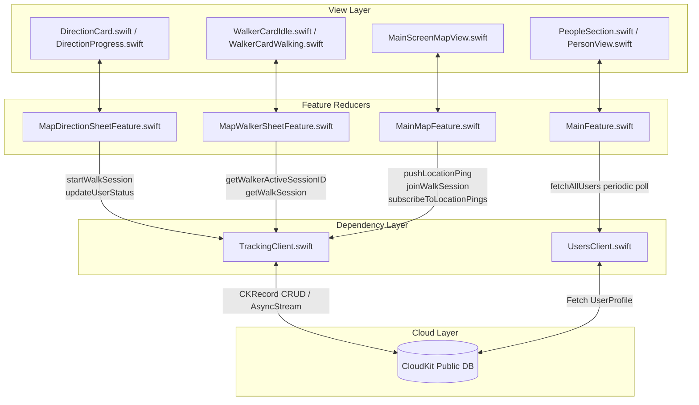

# Technical Architecture: `TrackingClient.swift` & Inter-File Ecosystem

## 1. System Topology & Inter-File Matrix



### File Responsibility & Dependency Matrix

| File | Role | Direct Interactions with `TrackingClient` |
| :--- | :--- | :--- |
| [`TrackingClient.swift`](file:///Users/dimasps32/Developer/apple-dev/challenge-apple-dev/challenge-5/Astar/Astar/Shared/CloudKit/TrackingClient.swift) | Service / Client Layer | Encapsulates CloudKit operations (`CKContainer.default().publicCloudDatabase`), models, and streaming logic. |
| [`MapDirectionSheetFeature.swift`](file:///Users/dimasps32/Developer/apple-dev/challenge-apple-dev/challenge-5/Astar/Astar/Features/Map/MapDirectionSheetFeature.swift) | Walker Navigation Reducer | Calls `startWalkSession` and `updateUserStatus("walking")` on navigation start; calls `updateUserStatus("idle")` on completion/cancellation. |
| [`MapWalkerSheetFeature.swift`](file:///Users/dimasps32/Developer/apple-dev/challenge-apple-dev/challenge-5/Astar/Astar/Features/Map/MapWalkerSheetFeature.swift) | Companion Sheet Reducer | Queries `getWalkerActiveSessionID` and `getWalkSession` to populate walker metadata before joining a session. |
| [`MainMapFeature.swift`](file:///Users/dimasps32/Developer/apple-dev/challenge-apple-dev/challenge-5/Astar/Astar/Features/Map/MainMapFeature.swift) | Parent Map Coordinator | **Walker Mode**: Pushes GPS breadcrumbs via `pushLocationPing`.<br>**Companion Mode**: Calls `joinWalkSession`, consumes `subscribeToLocationPings`, and updates live map markers. |
| [`MainFeature.swift`](file:///Users/dimasps32/Developer/apple-dev/challenge-apple-dev/challenge-5/Astar/Astar/Features/Main/MainFeature.swift) | App Root Reducer | Polls `UsersClient.fetchAllUsers` every 6 seconds to synchronize global user status (`"Walking"`, `"Idle"`, `"Accompanying"`). |
| [`MainScreenMapView.swift`](file:///Users/dimasps32/Developer/apple-dev/challenge-apple-dev/challenge-5/Astar/Astar/Features/Map/View/MainScreenMapView.swift) | SwiftUI Map View | Renders live coordinate updates, polylines, and triggers foreground refresh events (`willEnterForegroundNotification`). |

---

## 2. CloudKit Database Schema

`TrackingClient` uses three primary CloudKit record types in the Public Cloud Database:

```
[UserProfile] (Managed by LoginFeature & UsersClient)
  ├── recordID: "UserProfile_<appleUID>_<cloudUID>"
  ├── name: String
  ├── email: String
  ├── Status: String ("idle" | "walking" | "accompany")
  ├── activeWalkSessionRef: Reference -> [WalkSession]
  └── watchingSessionRef: Reference -> [WalkSession]

[WalkSession]
  ├── recordID: UUID String
  ├── walkerRef: Reference -> [UserProfile]
  ├── status: String ("active" | "completed")
  ├── destinationName: String
  ├── destinationLatitude: Double
  ├── destinationLongitude: Double
  ├── routePolyline: String (Optional, encoded polyline)
  ├── startedAt: Date
  ├── endedAt: Date (Optional)
  └── lastPingAt: Date

[SessionParticipant]
  ├── recordID: UUID String
  ├── sessionRef: Reference -> [WalkSession]
  ├── companionRef: Reference -> [UserProfile]
  └── joinedAt: Date

[LocationPing]
  ├── recordID: UUID String
  ├── sessionRef: Reference -> [WalkSession]
  ├── encodedCoordinates: [Data] (Serialized byte array of GPS coordinates)
  └── recordedAt: Date
```

---

## 3. `TrackingClient` Function Specifications

### 3.1. `startWalkSession`
```swift
var startWalkSession: @Sendable (
    _ walkerRecordID: String,
    _ destinationName: String,
    _ destLat: Double,
    _ destLon: Double,
    _ routePolyline: String?
) async throws -> WalkSession
```
- **Mechanism**: Instantiates a new `CKRecord(recordType: "WalkSession")`, creates a non-deleting `CKRecord.Reference` to `walkerRecordID`, writes initial timestamps, and saves via `db.save(record)`.
- **Caller**: [`MapDirectionSheetFeature.swift:216`](file:///Users/dimasps32/Developer/apple-dev/challenge-apple-dev/challenge-5/Astar/Astar/Features/Map/MapDirectionSheetFeature.swift#L216)

### 3.2. `updateUserStatus`
```swift
var updateUserStatus: @Sendable (
    _ userRecordID: String,
    _ status: String,
    _ activeSessionID: String?,
    _ watchingSessionID: String?
) async throws -> Void
```
- **Mechanism**: Fetches `UserProfile` record by ID, mutates `Status`, sets or clears `activeWalkSessionRef` and `watchingSessionRef` references, and persists changes.
- **Callers**:
  - `MapDirectionSheetFeature`: Sets status to `"walking"` on start, `"idle"` on end.
  - `MainMapFeature`: Sets status to `"accompany"` when joining a walk, `"idle"` when stopping.

### 3.3. `pushLocationPing`
```swift
var pushLocationPing: @Sendable (
    _ sessionID: String,
    _ coordinatesData: Data
) async throws -> Void
```
- **Mechanism**:
  1. Creates `CKRecord(recordType: "LocationPing")` with `sessionRef` pointing to `sessionID`.
  2. Sets `encodedCoordinates = [coordinatesData]`.
  3. Saves the record to CloudKit.
  4. Concurrently updates `WalkSession.lastPingAt` on the parent session record.
- **Caller**: [`MainMapFeature.swift:175`](file:///Users/dimasps32/Developer/apple-dev/challenge-apple-dev/challenge-5/Astar/Astar/Features/Map/MainMapFeature.swift#L175) inside the CoreLocation delegate stream.

### 3.4. `subscribeToLocationPings`
```swift
var subscribeToLocationPings: @Sendable (
    _ sessionID: String
) async throws -> AsyncStream<LocationPing>
```
- **Mechanism**:
  1. Returns an `AsyncStream<LocationPing>`.
  2. Spawns an internal `Task` that executes an indefinite polling loop while `!Task.isCancelled`.
  3. Fetches `CKQuery(recordType: "LocationPing", predicate: NSPredicate(value: true))`.
  4. Filters records in-memory by `sessionRef == sessionID` or `walkerRef`.
  5. Yields the latest ping via `continuation.yield(ping)`.
  6. Sleeps for 3,000,000,000 ns (3 seconds) between iterations.
  7. Wires `continuation.onTermination` to `task.cancel()`, ensuring no detached tasks or network leaks occur when companion dismisses the view.
- **Caller**: [`MainMapFeature.swift:701`](file:///Users/dimasps32/Developer/apple-dev/challenge-apple-dev/challenge-5/Astar/Astar/Features/Map/MainMapFeature.swift#L701).

---

## 4. Execution Traces

### Trace 1: Walker Initiates Session & Emits GPS Pings

```
1. User taps "Start Navigation" in DirectionCard.swift
   └─► Dispatches MapDirectionSheetFeature.Action.startNavigationTapped
       ├─► State mutation: state.isNavigating = true, state.mode = .progress
       └─► Spawns .run Effect:
           ├─► TrackingClient.startWalkSession(userRecordID, destName, lat, lon, polyline)
           │   └─► Saves CKRecord(type: "WalkSession") -> returns WalkSession(id: "WS_123")
           ├─► TrackingClient.updateUserStatus(userRecordID, "walking", "WS_123", nil)
           │   └─► Updates UserProfile in CloudKit
           └─► Sends delegate Action.navigationStarted(sessionID: "WS_123")

2. MainMapFeature receives Action.directionSheet(.delegate(.navigationStarted("WS_123")))
   └─► State mutation: state.activeUserWalkSessionID = "WS_123"

3. CoreLocation emits position update in LocationManagerClient stream
   └─► MainMapFeature receives Action.locationManager(.didUpdateLocations(locations))
       └─► Checks guard state.activeUserWalkSessionID != nil
           ├─► Encodes CLLocationCoordinate2D into Data payload
           └─► Calls TrackingClient.pushLocationPing("WS_123", data)
               ├─► Writes CKRecord(type: "LocationPing")
               └─► Touches WalkSession.lastPingAt
```

---

### Trace 2: Companion Discovers, Joins, and Streams Walker Location

```
1. MainFeature periodic loop (every 6s) executes Action.refreshPeople
   └─► UsersClient.fetchAllUsers() -> queries CloudKit UserProfile table
       └─► Walker's status is returned as "walking"
           └─► MainFeature updates state.people -> PersonView renders "Walking"

2. Companion taps Walker avatar in PeopleSection.swift
   └─► MainMapFeature sets state.walkerSheet = MapWalkerSheetFeature.State(walker)
       └─► MapWalkerSheetFeature receives Action.trackTapped
           └─► TrackingClient.getWalkerActiveSessionID(walkerRecordID) -> returns "WS_123"
           └─► TrackingClient.getWalkSession("WS_123") -> returns WalkSession metadata
           └─► Sends delegate Action.trackingStarted(walker, session)

3. MainMapFeature handles Action.walkerSheet(.delegate(.trackingStarted(walker, session)))
   ├─► TrackingClient.joinWalkSession("WS_123", companionRecordID)
   │   └─► Writes CKRecord(type: "SessionParticipant")
   ├─► TrackingClient.updateUserStatus(companionRecordID, "accompany", nil, "WS_123")
   │   └─► Updates Companion's status in CloudKit
   └─► Subscribes to TrackingClient.subscribeToLocationPings("WS_123")
       └─► Loop executes every 3s:
           ├─► Queries LocationPing records
           ├─► Stream yields LocationPing(coords)
           ├─► Dispatches MainMapFeature.Action.walkerLocationPingReceived(coords, polyline)
           ├─► State mutation: state.trackedWalkerCoordinate = coords
           └─► MainScreenMapView updates annotation position on map canvas
```

---

### Trace 3: Session Teardown & Cleanup

```
1. Walker arrives or cancels navigation
   └─► MapDirectionSheetFeature receives Action.endJourneyTapped / .cancelDirectionsTapped
       ├─► TrackingClient.updateUserStatus(userRecordID, "idle", nil, nil)
       └─► Sends delegate Action.navigationEnded

2. Companion taps "Exit Track" or dismisses sheet
   └─► MainMapFeature cancels the location ping subscription task
   └─► TrackingClient.subscribeToLocationPings onTermination triggers task.cancel()
   └─► TrackingClient.updateUserStatus(companionRecordID, "idle", nil, nil)
   └─► Clears tracked walker coordinates from map state
```

---

## 5. Technical Constraints & Design Decisions

1. **Polling vs. Push Notifications**:
   - `TrackingClient` utilizes client-side polling (`AsyncStream` + `Task.sleep`) rather than `CKQuerySubscription` / APNs.
   - *Rationale*: Eliminates requirement for Apple Push Notification Server (APNS) infrastructure, bypasses notification throttling, and functions reliably across development sandbox environments without remote push entitlements.

2. **In-Memory Query Filtering**:
   - CloudKit queries in development environments reject unindexed system fields (e.g. `___createTime` sort descriptor errors).
   - *Rationale*: `subscribeToLocationPings` fetches candidate records and applies predicate filtering and sorting in Swift memory, avoiding CloudKit Dashboard index setup failures during local test runs.

3. **Task Cancellation Guarantees**:
   - Polling tasks are scoped strictly to view lifecycle via TCA `Effect.run` and `cancellable(id:)`. Dismissing the sheet terminates the streaming task immediately.
